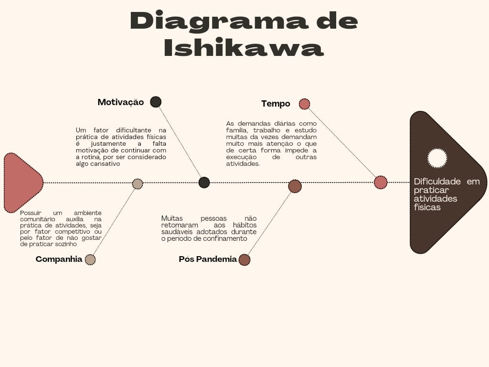

# Visão do Produto e do Projeto

## 1. Visão do Produto

### 1.2. Objetivo do Produto

 &emsp;&emsp;
O objetivo principal do RPGym é: 

- Oferecer uma plataforma que incentive e facilite a prática regular de atividades físicas, transformando o processo em uma experiência divertida e motivadora.

 &emsp;&emsp;
Em essência, o RPGym busca alcançar este objetivo fornecendo um aplicativo que permite aos usuários criar e personalizar seus próprios personagens virtuais, os quais evoluem à medida que o usuário realiza treinos físicos semanais. A plataforma oferece uma variedade de desafios, missões e metas que os usuários podem completar, ganhando recompensas e avançando em seu progresso pessoal.

 &emsp;&emsp;
Além disso, o RPGym visa criar uma comunidade engajada de usuários, onde eles possam interagir, competir e colaborar uns com os outros, compartilhando suas conquistas, desafios e dicas de treino. Isso cria um ambiente de apoio mútuo e incentivo, promovendo hábitos saudáveis de forma mais eficaz.

Abaixo o Diagrama de Ishikawa que serviu para orientar nossas ideias a resolução de um problema comum:

Figura 1: Diagrama de Ishikawa. Fonte: Centelha da Revolução, 2024.

|    Data    | Versão |                                            Descrição                                            |                                                                                                                            Autor(es)                                                                                                                            |
| :--------: | :----: | :---------------------------------------------------------------------------------------------: | :-------------------------------------------------------------------------------------------------------------------------------------------------------------------------------------------------------------------------------------------------------------: |
| 17/04/2024 |  1.0   |                         Criação do documento, adição do tópico 1.2                         | [Lucas Heler](https://github.com/Akaeboshi) |
