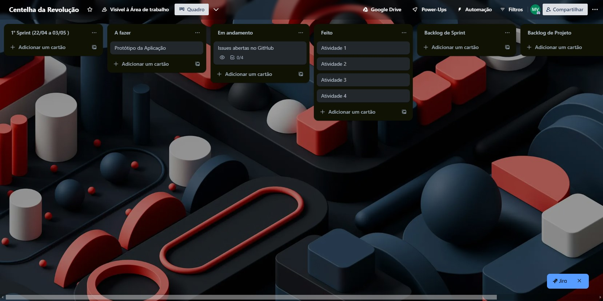

# Backlog

## Definition of Done (DoD) e Definition of Ready (DoR)
### DoR
- Todos compreenderam o Requisito?
- Documentação do levantamento dos requisito feita de forma objetiva e clara, de forma que possa ser consultada depois?
-  A equipe é capaz de realizar o desenvolvimento desse Requisito?
- O Product Owner aceitou e validou o requisito?

### DoD
- O Requisito atende aos critérios do backlog?
- O Requisito causou alguma instabilidade no sistema?
- O Requisito passou pelos testes?

# Técnicas de Elicitação e Descoberta de requisitos

Para garantir que nosso software atenda às necessidades e expectativas dos stakeholders, utilizamos várias técnicas de elicitação e descoberta de requisitos. A seguir, descrevo as técnicas que usamos no projeto:

Escolhemos começar com sessões de **brainstorming** para gerar uma ampla gama de ideias e possibilidades. Nessas sessões, incentivamos a participação livre e criativa de todos os envolvidos, permitindo que surgissem tanto requisitos óbvios quanto inovadores.

Além disso, realizamos **entrevistas detalhadas com os stakeholders**. Essas entrevistas foram fundamentais para entender profundamente as necessidades específicas de cada parte interessada, capturando tanto requisitos explícitos quanto implícitos que poderiam não ter sido identificados em um primeiro momento.

Também utilizamos **histórias e cenários** para descrever como os usuários finais interagem com o sistema. Essas histórias ajudaram a visualizar o uso real do software, garantindo que todos os requisitos funcionais e de usabilidade fossem considerados.

Por fim, conduzimos uma **análise de concorrentes** para identificar funcionalidades e características presentes em produtos similares no mercado. Essa análise nos permitiu compreender melhor o ambiente competitivo e identificar oportunidades de diferenciação para o nosso software.

### Técnicas Utilizadas

1. Brainstorming
2. Entrevista com Stakeholders
3. Histórias e Cenários
4. Análise de Concorrentes

A combinação dessas técnicas nos permitiu capturar um conjunto abrangente e detalhado de requisitos, garantindo que nosso software será bem-sucedido em atender às necessidades dos usuários e se destacará no mercado.

## SPRINTS 

### Sprint 0:
A equipe realizou na Sprint 0 um trabalho de forma mais assíncrona, visto que estávamos entendendo e organizando uma rotina de horários para cada um, não praticamos a cerimônia de relatório diário, mas houveram reuniões de alinhamento nos encontros em sala e também no Discord para a realização das Atividades.

