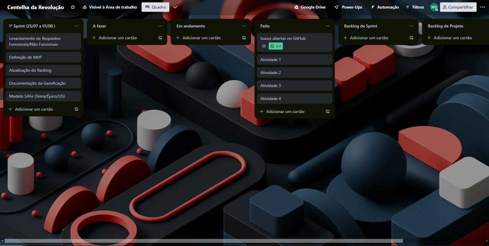

## SPRINTS 

### Sprint 0:
A equipe realizou na Sprint 0 um trabalho de forma mais assíncrona, visto que estávamos entendendo e organizando uma rotina de horários para cada um, não praticamos a cerimônia de relatório diário, mas houveram reuniões de alinhamento nos encontros em sala e também no Discord para a realização das Atividades.

### Sprint 1:
Conseguimos voltar a realizar as cerimônias do SCRUM de forma síncrona, houve a realização da Atividade proposta para a Missão 2 com as seguintes tarefas distribuidas entre os membros:
