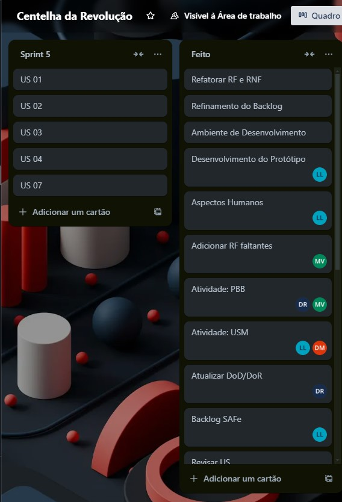
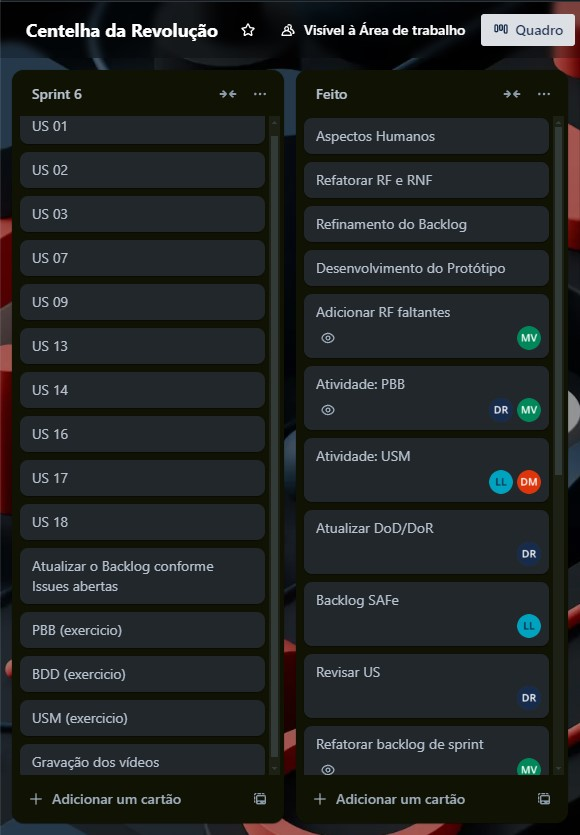

# Backlog das Sprints

Seção destinada à informações referentes as nossas Sprints de trabalho, contendo informações de planejamento de Sprint e também o andamento do nosso quadro Kanban disponível para a equipe na plataforma Trello.

---
## Cronograma de Sprints

| **Sprint**                                  | **Produto (Entrega)**                                                                                  | **Data Início** | **Data Fim** |
| ------------------------------------------- | ------------------------------------------------------------------------------------------------------ | --------------- | ------------ |
| [Sprint 0](./backlog-da-sprint.md#sprint-0) | Definição do Produto e Projeto                                                                         | 02/04/24        | 19/04/24     |
| [Sprint 1](./backlog-da-sprint.md#sprint-1) | Atividades e Técnicas de ER; Definição do Backlog do Produto; SAFe e User Story; Definição de MVP      | 25/07/24        | 01/08/24     |
| [Sprint 2](./backlog-da-sprint.md#sprint-2) | DoR e DoD; User Story Mapping                                                                          | 07/08/24        | 13/08/24     |
| [Sprint 3](./backlog-da-sprint.md#sprint-3) | Aspectos humanos e sociais da Engenharia de Requisitos; Modelos de casos de uso; Atividades: PBB e BDD | 14/08/24        | 20/08/24     |
| [Sprint 4](./backlog-da-sprint.md#sprint-4) | Criação do Protótipo, Setup do Ambiente de Desenvolvimento, Refinamento do Backlog                     | 20/08/24        | 27/08/24     |
| [Sprint 5](./backlog-da-sprint.md#sprint-5) | Implementação do MVP                                                                                   | 27/08/24        | 02/09/24     |
| [Sprint 6](./backlog-da-sprint.md#sprint-6) | Implementação e Entrega do MVP                                                                         | 02/09/24        | 09/09/24     |

---

## Sprint 0:

### Reunião de Planejamento:

Na reunião realizada no dia 02/04/24, abrimos uma exceção quanto à realização de uma Sprint com duração de 2 semanas para a realização das atividades propostas a serem entregues na [Missão 1](../../missoes/missao1.md), definimos que nesse período iríamos nos conhecer melhor como equipe e adotar uma abordagem proativa de execução de tarefas, com autonomia de escolha para desenvolvimento.

#### Atividades de Engenharia de Requisitos:
**Elicitação de Requisitos**: Durante esta sprint inicial, realizamos workshops e sessões de brainstorming com os stakeholders para entender as necessidades e expectativas principais do produto. Entrevistas com partes interessadas chave foram conduzidas para coletar requisitos iniciais e alinhar a visão do projeto.

### Reunião de Retrospectiva

A equipe realizou na Sprint 0 um trabalho de forma mais assíncrona, visto que estávamos entendendo e organizando uma rotina de horários para cada um. Não praticamos a cerimônia de relatório diário, mas houveram reuniões de alinhamento nos encontros em sala e também no Discord para a realização das Atividades.

---

## Sprint 1:

### Reunião de Planejamento:

Na reunião realizada no dia 25/07/24, revisamos os combinados de equipe adaptando nossa metodologia ágil anteriormente focada no SCRUM, visto que não estávamos conseguindo cumprir com os combinados, optamos por realizar apenas as cerimônias de Planejamento e Retrostpectiva.

Discutimos sobre como iriamos definir o Backlog do Produto, então realizamos o processo de [Elicitação e Descoberta de Requisitos](../backlog-do-produto/visao-do-produto/elicitacao-e-descoberta.md) além de definir nossas definições de [Pronto e Prepraparado](../backlog-do-produto/visao-do-produto/elicitacao-e-descoberta.md#definition-of-done-dod-e-definition-of-ready-dor).

#### Atividades de Engenharia de Requisitos:

**Análise de Requisitos**: Após a coleta de requisitos, fizemos uma análise detalhada para entender a viabilidade técnica e o impacto de cada requisito no projeto. Os requisitos foram priorizados de acordo com o valor de negócio e esforço necessário.

**Definição do Backlog do Produto**: Com base nos requisitos coletados e analisados, iniciamos a definição do backlog do produto. Transformamos os requisitos em histórias de usuário claras, cada uma com critérios de aceitação bem definidos, para garantir que todos os itens no backlog fossem compreendidos e prontos para desenvolvimento.

**Especificação de Requisitos**: Refinamos as histórias de usuário resultantes, detalhando-as para incluir critérios de aceitação específicos e condições de "Definition of Ready" (DoR) para garantir que todos os itens estivessem prontos para serem puxados para sprints futuras.

**Validação e Verificação**: Realizamos uma revisão interna das histórias de usuário e critérios de aceitação para garantir que estivessem alinhados com as necessidades dos stakeholders. Obtemos feedback adicional para garantir a clareza e completude dos requisitos definidos.

**Definições de Pronto e Preparado (DoD e DoR)**: Definimos as "Definition of Ready" (DoR) e "Definition of Done" (DoD) da equipe para garantir que todos os itens do backlog estejam bem preparados antes de serem incluídos em uma sprint, e que os critérios para concluir um item estejam claros e alinhados com as expectativas do cliente.

### Reunião de Retrospectiva

A equipe teve um momento de reflexão reconhecendo que a organização interpessoal não estava o ideal, conversamos e nos alinhamos novamente, visto que nessa Sprint passamos pela saída de dois membros da equipe, o que abalou consideravelmente o moral da equipe.

Ficamos contentes com a entrega da [Missão 2](../../missoes/missao2.md) apesar dos problemas enfrentados no decorrer da mesma, reprogamamos nosso cronograma e firmamos novos combinados, terminamos a reunião com a moral da equipe re-estabelecida e com a nossa comunicação fluindo como o desejado, de forma respeitosa e transparente.

---

## Sprint 2:

### Reunião de Planejamento:

Na reunião realizada no dia 07/08/24, decidimos em refatorar nosso Backlog de Sprint visto que devido às turbulências da Sprint anterior nossa documentação estava desatualizada e bagunçada, revisitamos também nosso Backlog de produto visando refinar nossas US.

#### Atividades de Engenharia de Requisitos:

**Revisão e Refinamento do Backlog de Produto**: Iniciamos o processo de refatoração do backlog da sprint e do produto. O objetivo foi garantir que todas as histórias de usuário estivessem atualizadas e refletissem os requisitos reais do cliente. A refatoração envolveu a remoção de itens redundantes, atualização de histórias de usuário incompletas ou desatualizadas, e a adição de novos requisitos identificados durante a reunião de validação com o cliente.

**User Story Mapping**: Realizamos o mapeamento de histórias de usuário para visualizar o fluxo de valor do produto, ajudando a identificar lacunas e dependências entre as histórias. Essa técnica permitiu uma melhor organização e priorização das histórias no backlog, garantindo que o desenvolvimento fosse orientado pelas necessidades mais importantes do usuário final.

**Revisão das Definições de Pronto e Feito (DoR e DoD)**: Revisamos e ajustamos os critérios de "Definition of Ready" (DoR) e "Definition of Done" (DoD) estabelecidos anteriormente, com base nos aprendizados da sprint anterior. Isso ajudou a garantir que todas as histórias de usuário estivessem devidamente preparadas antes de serem puxadas para a próxima sprint e que todos os critérios necessários para considerar uma história como concluída fossem claros.

### Reunião de Retrospectiva

Revisamos os contextos de DoR e DoD estabelecidos anteriormente e iniciamos o processo de User Story Mapping. Foi uma sprint conturbada, tivemos a perda de outro membro e também alguns problemas com horários e com a saúde de alguns membros, mas nada que impossibilitou nosso trabalho. Foi realizada uma reunião de validação dos requisitos com o cliente para que pudéssemos continuar com o mapeamento de requisitos em formato de histórias.

---

## Sprint 3:

### Reunião de Planejamento:

Na reunião realizada no dia 14/08/24, discutimos primariamente sobre como cada um estava se adaptando com as constantes mudanças na disciplina, para continuarmos alinhados, após isso definimos as atividades que seriam realizadas ao longo da Sprint, para a entrega da [Missão 3](../../missoes/missao3.md).

Após definir como iríamos desenvolver as atividades, percebemos nosso prazo curto quanto ao desenvolvimento do Produto em termos de software, então atualizamos as tecnologias utilizadas tanto em questão de projeto quanto produto visto que não estávamos utilizando tudo que propomos inicialmente, tornando nossa documentação centralizada totalmente no GitHub Pages.

#### Atividades de Engenharia de Requisitos:

**Aspectos Humanos e Sociais da Engenharia de Requisitos**: Focamos na compreensão dos aspectos humanos e sociais para garantir que as necessidades dos usuários finais fossem bem entendidas. 

**Modelos de Casos de Uso**: Desenvolvemos modelos de casos de uso para representar graficamente as interações entre os usuários e o sistema. Isso ajudou a identificar funcionalidades essenciais e priorizar o desenvolvimento de acordo com o impacto no usuário final. Os casos de uso também foram usados para validar e refinar requisitos específicos, garantindo que fossem claros e completos.

**Product Backlog Building (PBB)**: Utilizamos a técnica de PBB (Product Backlog Building) para refinar o backlog do produto, alinhando-o com as necessidades priorizadas dos stakeholders. Criamos histórias de usuário adicionais, detalhando o escopo do trabalho necessário para a entrega da Missão 3, e alinhamos com a visão do produto.

**Behavior-Driven Development (BDD)**: Adotamos a abordagem de BDD (Behavior-Driven Development) para definir requisitos de forma colaborativa, usando exemplos práticos de comportamento do sistema a partir da perspectiva do usuário. Isso nos ajudou a criar especificações claras e orientadas a comportamentos, facilitando o desenvolvimento e os testes de funcionalidades.

### Reunião de Retrospectiva

A equipe se mostrou pela primeira vez alinhada totalmente, nossas engrenagens finalmente estavam em sincronia e produzimos tudo o que foi proposto a ser entregue na [Missão 3](../../missoes/missao3.md), fizemos um pequeno momento de feedback individual para que os membros pudessem explicar como estavam em questão de rotina de produção e de alinhamento com a equipe, esse processo foi essencial pois após isso percebemos que nosso grupo apesar de todas as dificuldades estava junto e disposto a superar as dificuldades como um time.

---

## Sprint 4:

### Reunião de Planejamento:

Na reunião realizada no dia 20/08/24, discutimos sobre os pontos levantados pela Professora Cristiane após nossa reunião de controle presencial acerca do projeto e realizamos um levantamento dos pontos necessários no refinamento do nosso Backlog geral (Produto, Projeto e Sprint) e chegamos a conclusão que necessitávamos de uma repaginada geral na nossa documentação, visto que nossos documentos estavam desorganizados entre si e muito granularizados.

#### Atividades de Engenharia de Requisitos:

**Refinamento do Backlog**: Iniciamos um processo de refinamento do backlog, reorganizando e consolidando as histórias de usuário, tarefas, e outros artefatos de projeto. Atualizamos as prioridades com base nos feedbacks recebidos e garantimos que cada item do backlog estivesse alinhado com os objetivos estratégicos do projeto. Esse refinamento também incluiu a redefinição de critérios de aceitação para garantir que as entregas futuras estejam de acordo com as expectativas dos stakeholders.

**Revisão e Atualização da Documentação de Requisitos**: Realizamos uma revisão detalhada de toda a documentação de requisitos, centralizando as informações no GitHub Pages para garantir acessibilidade e clareza. Consolidamos documentos redundantes e fragmentados, criando uma estrutura mais coesa e integrada, facilitando a navegação e a compreensão por parte de todos os membros da equipe e stakeholders.

**Revisão de Casos de Uso e Modelagem**: Ajustamos os modelos de casos de uso existentes para refletir as mudanças nas prioridades e nos requisitos do produto. Revisamos e refinamos os cenários de uso, garantindo que todos os fluxos de trabalho e interações do usuário estivessem corretamente documentados e alinhados com o escopo atualizado do projeto.

**Validação e Verificação Contínua**: Com base nos feedbacks dos professores e stakeholders, realizamos sessões contínuas de validação e verificação dos requisitos para garantir que as modificações atendiam às necessidades do projeto. Este processo ajudou a identificar e corrigir quaisquer discrepâncias antes que se tornassem problemas maiores no desenvolvimento.

### Reunião de Retrospectiva

Após a realização do ponto de controle presencial junto à Professora Cristiane e ao Professor George, ficamos mais tranquilos em questão à nossa documentação devido aos feedbacks aplicados pelos professores.

O feedback positivo foi essencial para o levantamento do moral da equipe que no geral estava bem preocupada quanto a qualidade do nosso projeto.

---

## Sprint 5:

### Reunião de Planejamento:

Na reunião realizada no dia 27/08/24, a equipe optou por revisitar o MVP, levando em consideração todo o replanejamento ocorrido ao longo das últimas Sprints identificamos que o que estava definido anteriormente não seria possível de ser realizado com contigente reduzido fora o pouco tempo disponível.

Com o novo modelo de MVP em mãos, a equipe foi dividida em times de backend e frontend, cada um focado em desenvolver as features necessárias para a entrega do MVP 1, respeitando o nosso combinado de autonomia dentro da equipe. O foco foi em entregar o valor máximo dentro das capacidades atuais, priorizando as funcionalidades de maior impacto para os usuários e stakeholders.

#### Atividades de Engenharia de Requisitos:

**Redefinição do MVP**: Revisitamos e redefinimos o escopo do MVP, priorizando os requisitos mais críticos e ajustando as expectativas com base nos recursos disponíveis e no tempo restante. Esse processo envolveu a revisão de todas as histórias de usuário e requisitos no backlog, para garantir que o novo MVP representasse um conjunto mínimo de funcionalidades viáveis e alinhadas com a visão do produto.

**Alinhamento dos Times com os Requisitos**: Dividimos a equipe em times de backend e frontend, garantindo que ambos estivessem bem alinhados com os requisitos redefinidos para o MVP. Requisitos específicos foram mapeados para as entregas de cada time, assegurando que todas as funcionalidades críticas fossem cobertas e que o desenvolvimento ocorresse de forma coordenada e integrada.

**Priorização Baseada em Impacto e Viabilidade**: Utilizamos uma abordagem de priorização baseada em impacto e viabilidade, identificando quais funcionalidades agregariam maior valor ao usuário final com o menor custo de implementação. Isso permitiu uma melhor alocação dos recursos humanos e técnicos da equipe, otimizando o desenvolvimento dentro do prazo apertado.

**Monitoramento Contínuo e Adaptação**: Estabelecemos checkpoints regulares para monitorar o progresso de cada time em relação aos requisitos do MVP. Esse monitoramento contínuo permitiu adaptações rápidas, garantindo que os esforços da equipe fossem direcionados para as áreas mais críticas e alinhadas com os objetivos da sprint.

### Reunião de Retrospectiva

Conversamos sobre o andamento do desenvolvimento do projeto em um formato de mesa redonda aonde de forma transparente e respeitosa conversamos sobre nossos atrasos e como organizar nossos recursos humanos de forma eficiente para o desenvolvimento, visto a preocupação da equipe em relação ao prazo apertado.

Não conseguirmos entregar por completo nenhuma das tarefas propostas inicialmente mas ficamos contentes com o andamento do desenvolvimento do projeto, que agora já possui código em produção.

---

## Sprint 6:

### Reunião de Planejamento:

Na reunião realizada no dia 02/09/24, conversamos a respeito da entrega da Missão 4, o qual o escopo foi disponibilizado no professor na mesma data, que consistia na entrega da versão atualizada do Backlog, entrega do MVP 1 estabelecido e a realização dos exercícios propostos em sala de aula, além da gravação de dois vídeos sendo um apresentando nosso produto e outro com o cliente validando o mesmo.

#### Atividades de Engenharia de Requisitos:

**Atualização do Backlog e Revisão de Requisitos**: Realizamos uma revisão detalhada do backlog, incorporando ajustes e melhorias com base nos feedbacks recebidos nas sprints anteriores. Atualizamos as histórias de usuário e redefinimos critérios de aceitação para refletir o estado atual do desenvolvimento e as necessidades emergentes do cliente. Isso garantiu que o backlog estivesse completo, claro e alinhado com as expectativas do cliente para a entrega do MVP 1.

**Validação do Produto com o Cliente**: Organizamos uma sessão de validação com o cliente para demonstrar a aplicação desenvolvida. Durante essa sessão, capturamos feedback em tempo real sobre a usabilidade, funcionalidades e possíveis melhorias, e utilizamos essas informações para fazer ajustes finais antes da entrega oficial do MVP.

**Preparação e Gravação dos Vídeos**: Planejamos e gravamos dois vídeos: um de apresentação do produto, destacando suas funcionalidades principais e o valor entregue, e outro com o cliente validando a solução, reforçando a relevância e a utilidade do produto no contexto de negócio do cliente. Esses vídeos foram organizados de maneira a demonstrar claramente o alinhamento entre o produto final e os requisitos inicialmente definidos.

**Deploy da Aplicação**: Realizamos o deploy da aplicação, assegurando que o ambiente de produção estivesse corretamente configurado e que o produto funcionasse conforme o esperado. Testes finais foram conduzidos para verificar a estabilidade, segurança e performance da aplicação, garantindo que todos os requisitos técnicos e de qualidade fossem atendidos.

### Reunião de Retrospectiva

Durante a retrospectiva, cada integrante do grupo relatou suas entregas conforme o combinado na planning. Discutimos os pontos fortes e as áreas que poderiam ser melhoradas, destacando a importância do trabalho colaborativo e da comunicação contínua ao longo da sprint. O deploy bem-sucedido da aplicação foi celebrado como um marco importante, e a sessão de feedback com o cliente foi vista como uma oportunidade valiosa para ajustar e refinar o produto antes da entrega final.
