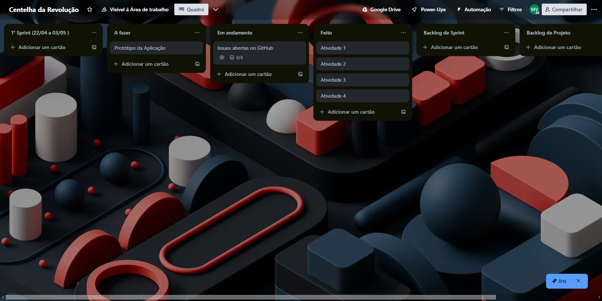
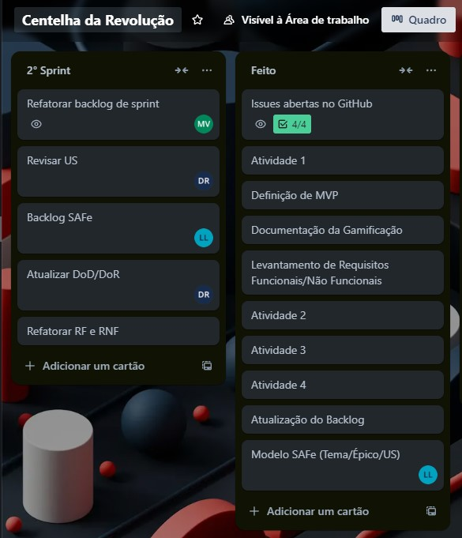
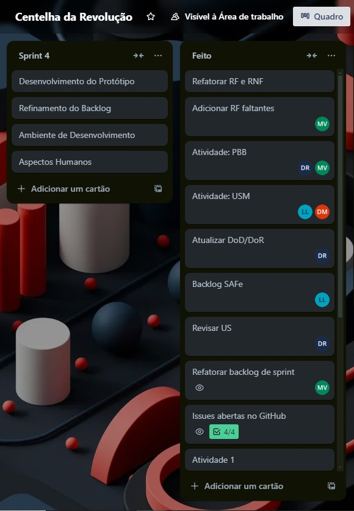

### Sprint 0:

A equipe realizou na Sprint 0 um trabalho de forma mais assíncrona, visto que estávamos entendendo e organizando uma rotina de horários para cada um. Não praticamos a cerimônia de relatório diário, mas houveram reuniões de alinhamento nos encontros em sala e também no Discord para a realização das Atividades.

### Sprint 1:

| Tarefas as serem desenvolvidas    | Responsável |
| --------------------------------- | ------------ |
| Atividades e Técnicas de ER      | Dara         |
| Definição do Backlog do Produto | Davi         |
| SAFe                              | Lucas        |
| Definição de MVP                | Mateus       |
| Gamificação                     | Mateus, Davi |

Conseguimos voltar a realizar as cerimônias do SCRUM de forma síncrona, houve a realização da Atividade proposta para a Missão 2 com as seguintes tarefas distribuídas entre os membros.

### Sprint 2:

| Tarefas as serem desenvolvidas | Responsável |
| ------------------------------ | ------------ |
| DoR e DoD;                     | Mateus       |
| User Story Mapping             | Equipe       |

Revisamos os contextos de DoR e DoD estabelecidos anteriormente e iniciamos o processo de User Story Mapping. Foi uma sprint conturbada, tivemos a perda de outro membro e também alguns problemas com horários e com a saúde de alguns membros, mas nada que impossibilitou nosso trabalho. Foi realizada uma reunião de validação dos requisitos com o cliente para que pudéssemos continuar com o mapeamento de requisitos em formato de histórias.

### Sprint 3:

| Tarefas as serem desenvolvidas                         | Responsável |
| ------------------------------------------------------ | ------------ |
| Aspectos humanos e sociais da Engenharia de Requisitos | Lucas        |
| Modelos de casos de uso                                | Equipe       |
| Atividades: USM                                        | Lucas, Dara  |
| Atividades: PBB                                        | Mateus, Davi |

Focamos nos aspectos humanos e sociais da Engenharia de Requisitos e na modelagem de casos de uso. A equipe conseguiu se ajustar bem e as cerimônias do SCRUM não foram realizadas conforme o planejado, acabou que pelo mal uso acabamos deixando de realizar as dailys e nos manter atualizados por entrega e nas aulas presenciais. A revisão dos modelos de casos de uso ajudou a esclarecer as funcionalidades e a interatividade do sistema. A colaboração foi eficaz, e os resultados foram bem recebidos pelo cliente.

### Sprint 4:

A realizar...

### Sprint 5:

A realizar...

