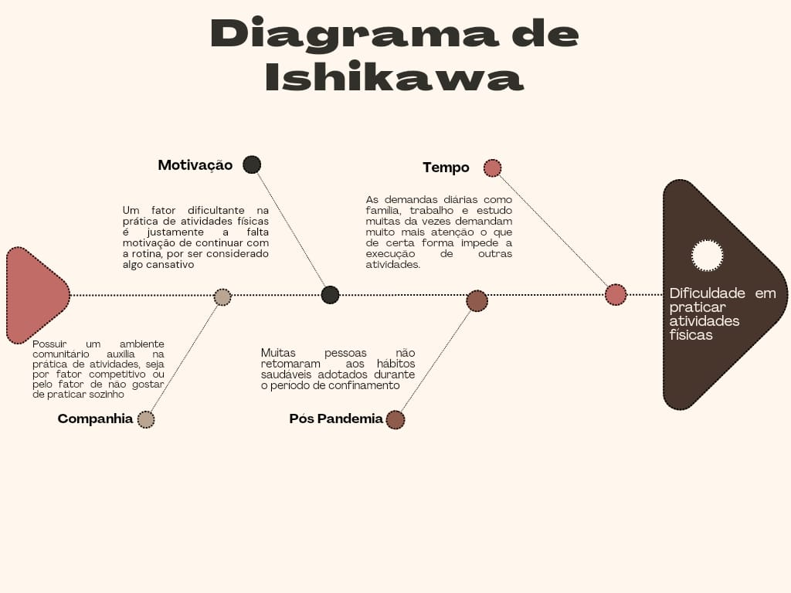

# Visão Geral do Produto

## Problema

O Problema que identificamos foi em relação a dificuldade em praticar atividades físicas.

## Objetivo do Produto

Oferecer uma plataforma que incentive e facilite a prática regular de atividades físicas, transformando o processo em uma experiência divertida e motivadora.

Em essência, o RPGym busca alcançar este objetivo fornecendo um aplicativo que permite aos usuários criar e personalizar seus próprios personagens virtuais, os quais evoluem à medida que o usuário realiza treinos físicos semanais. A plataforma oferece uma variedade de desafios, missões e metas que os usuários podem completar, ganhando recompensas e avançando em seu progresso pessoal.

Além disso, o RPGym visa criar uma comunidade engajada de usuários, onde eles possam interagir, competir e colaborar uns com os outros, compartilhando suas conquistas, desafios e dicas de treino. Isso cria um ambiente de apoio mútuo e incentivo, promovendo hábitos saudáveis de forma mais eficaz.

Abaixo o Diagrama de Ishikawa que serviu para orientar nossas ideias a resolução de um problema comum:

Figura 1: Diagrama de Ishikawa. Fonte: Centelha da Revolução, 2024.

## Histórico de Versão

|    Data    | Versão | Descrição                                  | Autor(es)                                   |
| :--------: | :----: | :----------------------------------------- | :------------------------------------------ |
| 17/04/2024 |  1.0   | Criação do documento, adição do tópico 1.2 | [Lucas Heler](https://github.com/Akaeboshi) |
| 18/04/2023 |  1.1   | Atualização com o problema do produto      | [Mateus Vieira](https://github.com/matix0)  |
| 04/09/2024 |  2.0   | Modificação segundo issue aberta pela monitora | [Mateus Vieira](https://github.com/matix0)  |
