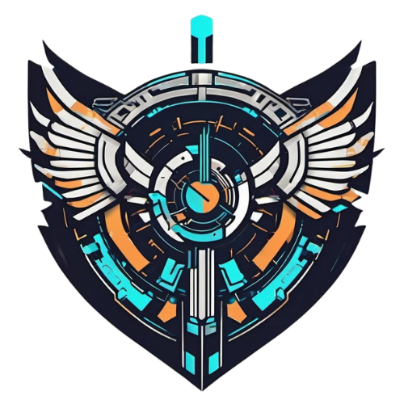
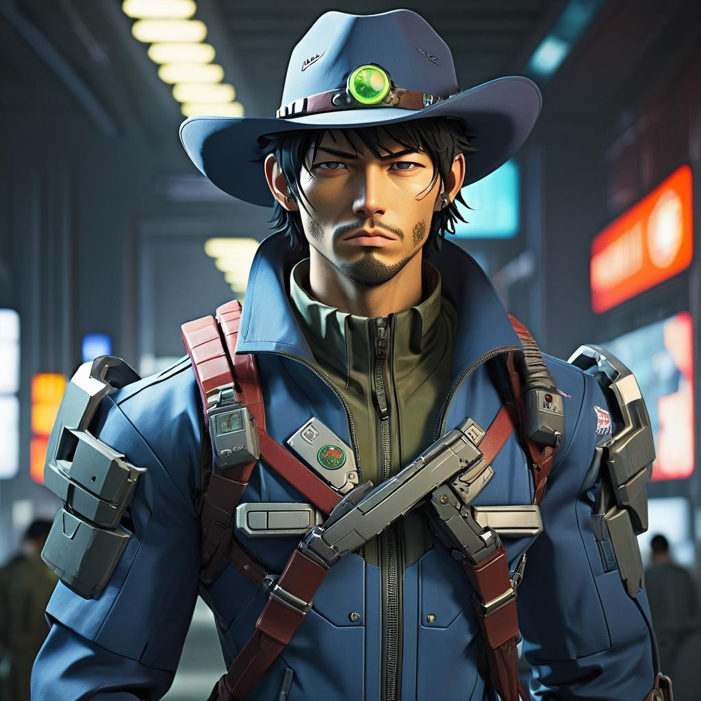
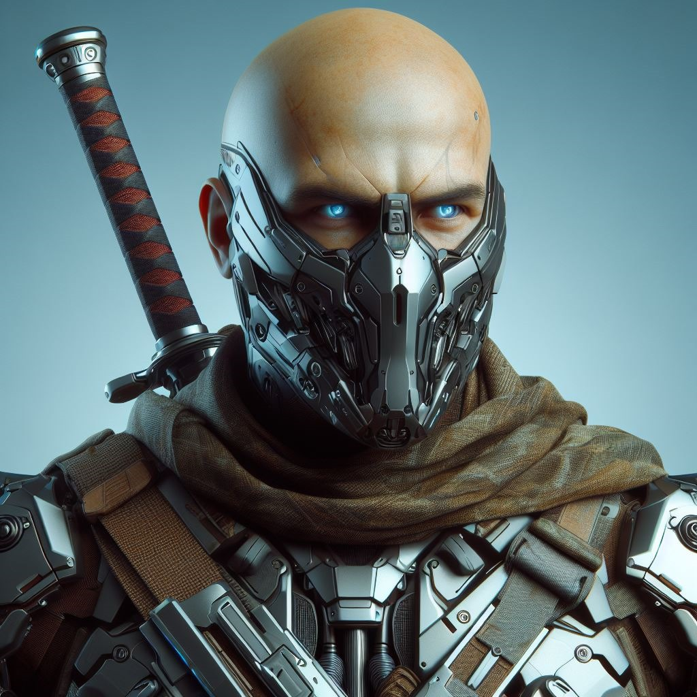
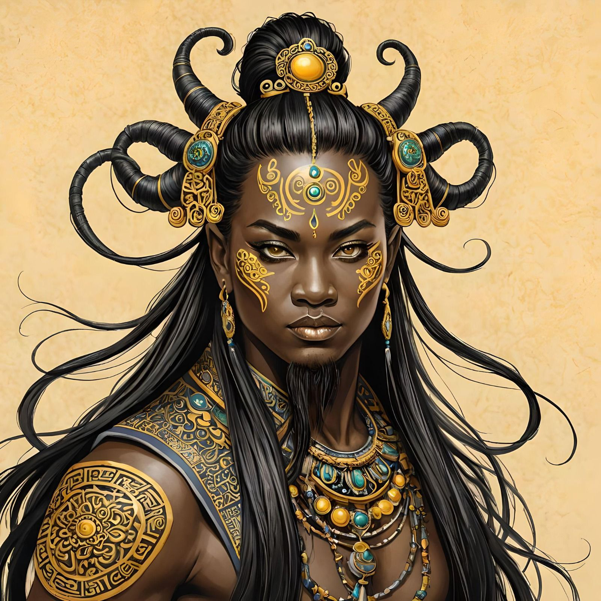

# Centelha da Revolução

## Emblema da Facção

O emblema da Centelha da Revolução foi concebida com componentes visuais que capturam a essência da história da facção: A vanguarda que bateria de frente com as Big Techs que apenas pensam em explorar, explorar e explorar, devolvendo os saques em forma de bens para os povos afetados por esses conglomerados. Assim, o emblema evoca a atmosfera severa de Calamum Caereleum, uma revolução que busca ser os mais mercenários entre os mercenários.

## História da facção

Fundado por um grupo de mercenários que cansados de ver a exploração desenfreada que vinha sendo feita pela Spark Tech, a Centelha da Revolução surgiu como uma vanguarda que bateria de frente com as Big Techs que apenas pensam em explorar explorar e explorar.

Agindo discretamente, a Centelha planeja cada golpe com precisão. Suas ações são cirúrgicas, visando minar o poder das Big Techs sem causar danos desnecessários. Eles são mestres da discrição, operando nas sombras para evitar atenção indesejada. 

Redistribuem recursos roubados de volta para as comunidades exploradas. Hospitais, escolas e abrigos são financiados com o dinheiro das próprias corporações que os saquearam.

### Personagens

<h3><b> Caenis </b></h3>

Caenis, um burguesinho safado, sempre se destacou entre os demais da sua classe estelar. Desde jovem, ele desprezava as normas impostas pela sua família de elite e almejava algo mais profundo do que a vida superficial da alta sociedade intergaláctica. Sua aversão se intensificou quando ele descobriu que seu tio, o Barão do Setor Estelar da Spark Tech, não só mantinha escravos, mas os submetia a experimentos, transformando-os em seres híbridos para vendê-los como mercadoria.

Profundamente chocado, Caenis agiu por uma mistura de indignação e compaixão, tentando libertar os escravos. No entanto, sua tentativa resultou em sua captura pelo tio, que, em retaliação, o transformou em uma criatura etérea, onde em centenas de anos atrás, também eram conhecidos como fadas, e o aprisionou. Determinado e notavelmente resiliente, ele conseguiu escapar e liderou uma rebelião junto aos escravos híbridos, derrubando o regime escravocrata de seu tio.

No clímax da batalha, seu tio, desesperado, arrancou suas asas com um golpe, deixando-o à beira da morte. Nesse momento crítico, o esquadrão de combate da Centelha da Revolução entrou na batalha, fornecendo a ajuda necessária para Caenis escapar das garras de seu tio enfurecido. Após se recuperar, profundamente grato a Faccção, Caenis aceitou a oferta de sair pela galáxia, dedicados à libertação de mundos oprimidos e à derrota da tirania corporativa que assola as estrelas.

Desde então, agora ciente das injustiças perpetradas por sua classe, Caenis continua a frequentar os mesmos ambientes da alta classe, utilizando suas habilidades de fada não apenas para seu próprio divertimento, mas também para desafiar a burguesia intergaláctica.

 

<h3><b> Zal </b></h3>

Em um canto distante da galáxia Calamum Caeruleum, existia Zal, uma soldada endurecida pelo destino que, desde jovem, carregava o peso de um passado dilacerante: a perda de seus pais, vítimas das garras cruéis da ganância humana. Consumida pelo desejo de vingança, ela se tornou uma mercenária implacável, cuja determinação era tão forte quanto sua natureza arrogante.

A tragédia se abateu sobre Zal mais uma vez quando sua irmã foi brutalmente assassinada diante de seus olhos pelo conglomerado Slitherium, que devastava mundos inteiros em suas buscas implacáveis por minerais raros, marcando-a para sempre. Esse evento cruel e traumático só serviu para reforçar sua determinação em encontrar os responsáveis e fazer justiça com suas próprias mãos. Movida por uma mistura de ódio e amor, Zal dedicou sua vida à busca pelo assassino de sua irmã, traçando um caminho repleto de perigos e desafios.

Enquanto Zal percorria os confins da galáxia em sua jornada, sua sede de vingança era como uma chama ardente, guiando-a através das trevas do universo. No entanto, em seu coração, ela mantinha a esperança de que um dia encontraria a redenção e a paz que tanto almejava, mesmo que isso significasse enfrentar os próprios demônios que a assombravam.

 

<h3><b> Spiegel </b></h3>

Descendente de uma família militar, Spiegel sempre se destacou entre os treinamentos como um excelente soldado, por sempre seguir ordens e possuir aptidão de combate, tornando-o quase que uma máquina de combate, mas que após se cansar de apenas matar em nome dos grandes que comandavam o mundo funda a centelha da revolução como forma de redenção com o mundo, começando assim sua jornada de redenção.

 

<h3><b> Orion </b></h3>

No planeta natal chamado Alpharius, um ser de nome desconhecido desfrutava de uma vida pacífica, imerso na rica cultura e na comunidade calorosa que caracterizava seu povo. No entanto, esse paraíso foi abruptamente interrompido quando o conglomerado Spark Tech, em busca de cobaias humanas, invadiu o planeta com sua implacável sede de tecnologia. Durante o ataque, esse mesmo ser foi capturado pelos agentes da Spark Tech, arrancado de seu lar e submetido a terríveis experiências em seus laboratórios sinistros.

Forçado a participar de testes brutais, onde apenas os mais fortes sobreviveriam, esse ser testemunhou companheiros de cativeiro sendo sacrificados em nome da ganância do conglomerado. Em meio a esse pesadelo, ele se destacou como o candidato mais promissor, superando cada desafio imposto com determinação implacável. No entanto, sua vitória veio com um preço alto: uma lavagem cerebral que apagou sua identidade, rebatizando seu nome que atualmente é conhecido como "Orion", uma criação da própria Spark Tech. Orion testemunhou o propósito do experimento, a criação do seu primeiro clone, uma sombra que atualmente se encontra nevoada do que um dia ele foi, cujo destino permanece um mistério para ele até os dias de hoje.

Apesar da lavagem cerebral, vestígios da antiga identidade de Orion ainda persistiam, como uma sombra em sua mente obscurecida. Sua salvação veio nas mãos da facção mercenária conhecida como Centelha da Revolução, cuja missão de proteger os desamparados e desafiar os poderosos ressoava profundamente nele. Orion juntou-se a eles, encontrando um novo propósito como um guerreiro renascido, determinado a lutar contra a opressão e a injustiça que testemunhou em primeira mão. Essa facção não apenas lhe deu um lar, mas também lhe deu uma nova identidade: Um defensor destemido dos oprimidos, um protetor dos fracos e uma ameaça aos tiranos que ameaçam o equilíbrio de Calamum Caeruleum.

 

<h3><b> O Lâmina </b></h3>

Igor Guilherme, também conhecido como O Lâmina, ficou órfão bem novo e foi criado por integrantes de uma pequena guilda de guerreiros defensores de seu planeta natal, onde aprendeu suas habilidades de combate e dominou o uso de lâminas. Perdeu seus olhos lutando para defender seu povo de um ataque Apache, o que o levou a instalar próteses de localização espacial que o ajudaram a evoluir em combate a custo de enxergar em preto e branco.

Com sua guilda e planeta praticamente destruídos, começou a trabalhar sozinho em qualquer missão que pagasse bem. Devida a fama de sua perícia com seu sabre de energia Igor atraiu atenção indesejada e recebeu um contrato-emboscada do qual foi salvo, por coincidência, pela facção mercenária Centelha da Revolução, a qual considerou ser eternamente devedor e decidiu acompanhar e proteger enquanto respirasse.

O objetivo de sua vida passou a ser não apenas se vingar do conglomerado Apache, mas enfraquecer, desorganizar e desestabilizar todo e qualquer conglomerado ou indivíduo opressor. Para isso, Lâmina usa de todo espólio que acumula com a Centelha da Revolução para apoiar guerrilhas e forças de resistência por todo o universo conhecido, vivendo com o mínimo necessário e suficiente.

 

<h3><b> Bellatrix </b></h3>

Bellatrix nasceu como herdeira de um dos reinos mais avançados da galáxia, onde a ciência e a tecnologia reinam supremas. Desde jovem, ela demonstrou uma mente brilhante e uma habilidade excepcional para a tecnologia, deixando claro que ela seria mais do que apenas uma princesa. À medida que crescia, Bellatrix mergulhava cada vez mais nos segredos da tecnologia, desenvolvendo inovações que impressionavam até mesmo os mais sábios cientistas de seu reino. Seu desejo por aventura e descoberta a levou além das fronteiras seguras de seu lar, onde ela logo se viu envolvida em uma luta contra as forças do mal que ameaçavam sua galáxia. Determinada a proteger seu povo e seu reino, Bellatrix assumiu o papel de uma mercenária destemida, usando seu poderoso arsenal de armas tecnológicas para enfrentar os inimigos que se atreviam a desafiar sua autoridade.

Sua armadura tecnológica, equipada com blasters de alta potência, campos de força defensivos e dispositivos de camuflagem, tornou-a uma força a ser reconhecida em batalha.
Ao lado de seus leais companheiros, Bellatrix viajou por mundos desconhecidos, enfrentando perigos inimagináveis e descobrindo segredos há muito perdidos. Enquanto lutava contra as forças do mal, ela também buscava respostas sobre sua própria origem e o papel que ela desempenharia no destino da galáxia.
Com coragem, determinação e uma mente brilhante, Bellatrix se tornou uma lenda na galáxia, uma princesa guerreira cujo nome será lembrado por todas as gerações que vierem depois dela.

## Histórico de Versão

| Data | Versão                                   | Descrição                                          | Autor(es)                     |
| :------------: | :--------------------------------------: | :-----------------------------------------------: | :--------------------------: |
17/04/2023 | 1.0 | Criação do documento, da história da facção e dos personagens da facção | [Davi Rodrigues](https://github.com/DaviRogs) |