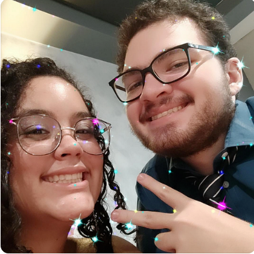
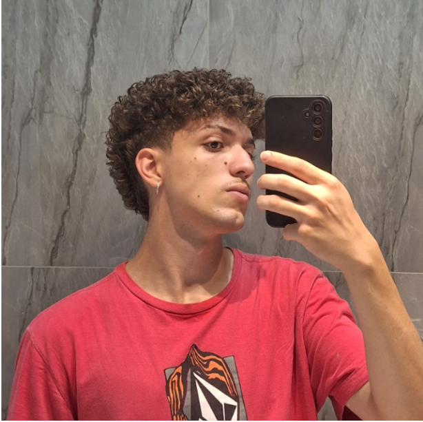

## RPGym

O RPGym é um projeto que visa incentivar o público de academia, entretanto, necesitam de um incentivo para ir diariamente ou na maior parte das vezes. De forma geral, a plataforma será gamificada

O projeto em questão foi desenvolvido pelos dicentes que cursam a disciplina de Requisitos de Software na Universidade de Brasília (UnB).

## Integrantes

| Membro | Nome                                   | Personagem                                          | GitHub                     |
| :------------: | :--------------------------------------: | :-----------------------------------------------: | :--------------------------: |
| Dara Maria barbosa de Sousa | Bellatrix | [daramariabs](https://github.com/daramariabs) |
 | Davi Rodrigues da Rocha | Orion | [DaviRogs](https://github.com/DaviRogs)  |
 | Genilson Silva de Araújo Júnior | Zal | [GenilsonJrs](https://github.com/GenilsonJrs) |
| Isaque Colem Bastos de Quental | O Lâmina | [isaquecolem](https://github.com/isaquecolem) |
 | Lucas Heler Lopes  | Caenis | [Akaeboshi](https://github.com/Akaeboshi) |
 | Mateus Vinicius Vieira  | Spiegel | [matix0](https://github.com/matix0) |

