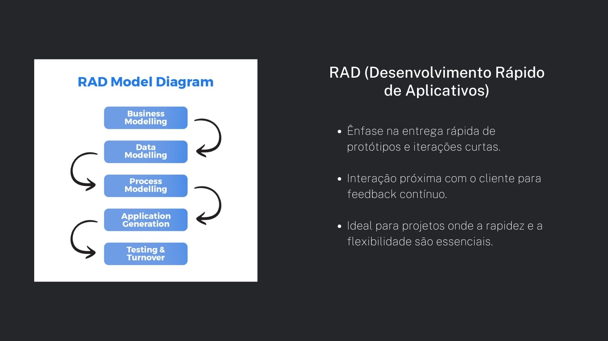
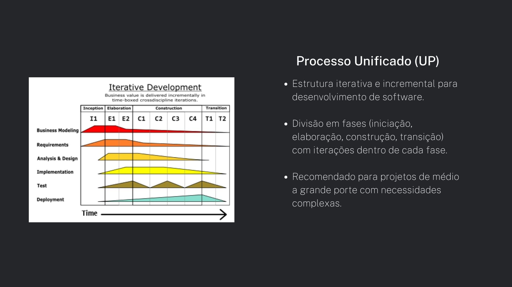
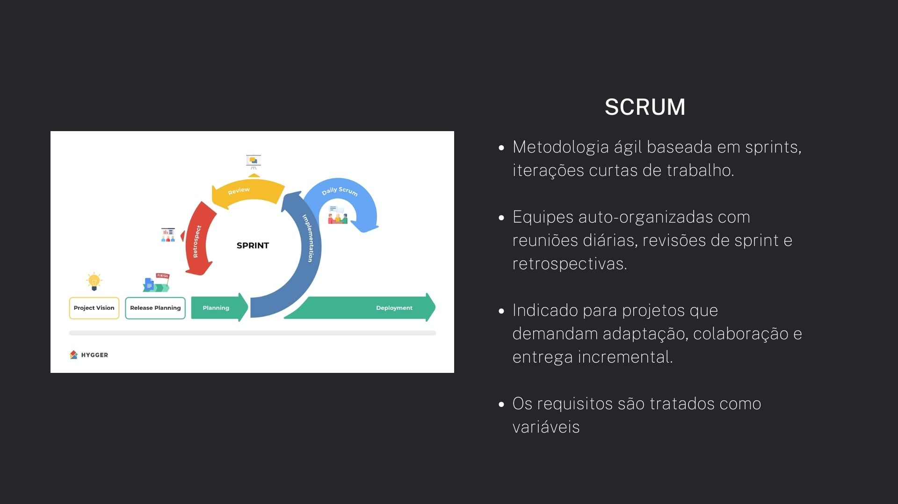
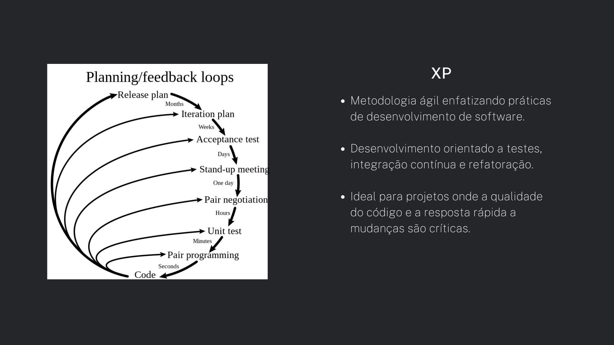
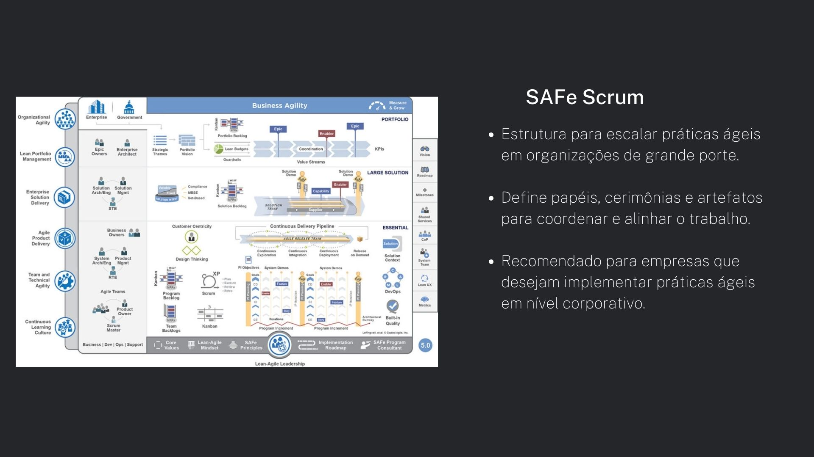
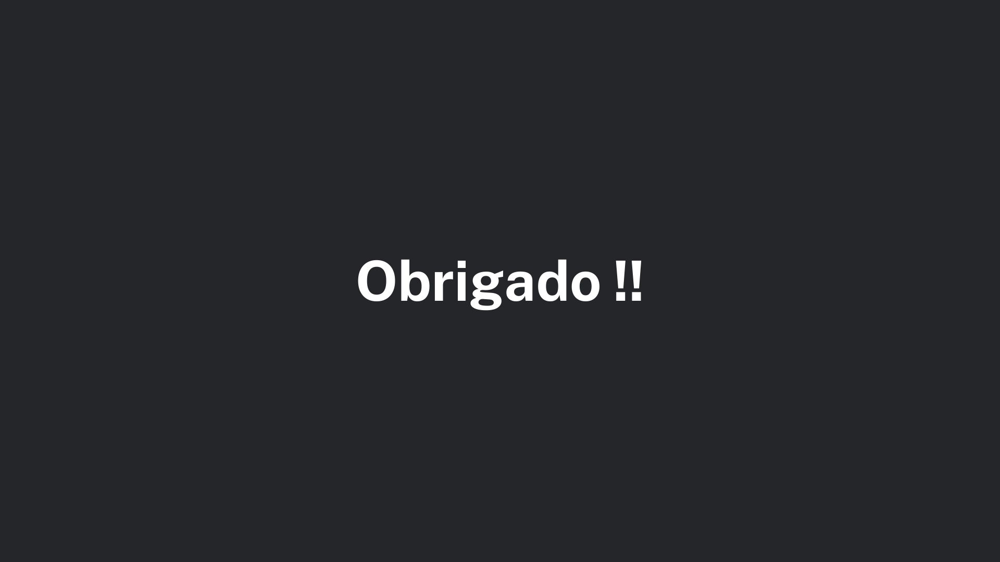

### Apresentação Unidade 1
<iframe width="560" height="315" src="https://www.youtube.com/embed/g-8datnKDiU" frameborder="0" allowfullscreen></iframe>

### Seminário
# Material do Seminário Processos ESW

## Material do Seminário

### LIÇÕES APRENDIDAS

Os membros do grupo desde o primeiro contato possuem uma comunicação bem clara, tornando o desenvolvimento das atividades propostas algo bem tranquilo, com cada um fazendo sua parte, tivemos a oportunidade de nos desenvolver inicialmente como equipe, conhecendo melhor a rotina de cada um e designando responsabilidades de acordo com a necessidade do projeto. Devido a isso temos um aprendizado empírico com o pilar de transparência do Scrum, que é algo estabelecido desde a formação do grupo.

## Histórico de Versão

|    Data    | Versão |                 Descrição                 |                Autor(es)                |
| :--------: | :-----: | :-----------------------------------------: | :-------------------------------------: |
| 18/04/2024 |   1.0   | Criação do documento de Visão do Projeto | [Mateus Vieira](https://github.com/matix0) |
