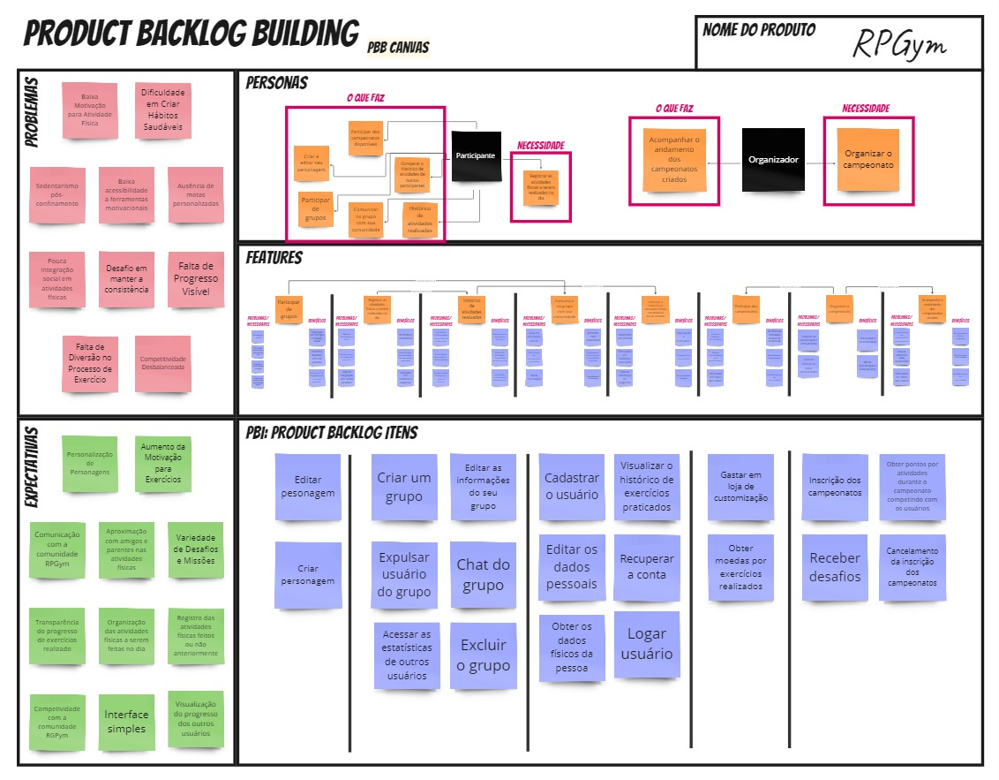
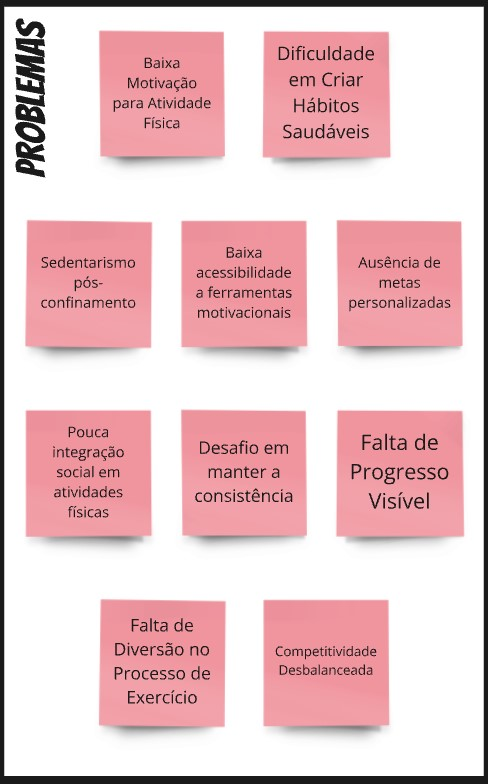
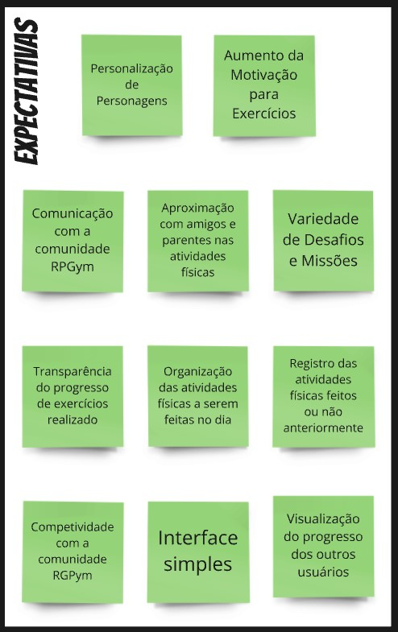
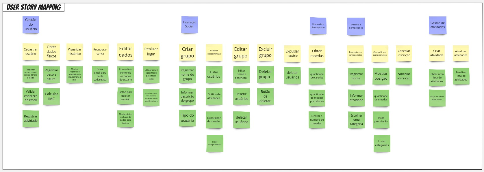

# Missão 3

## Apresentação Unidade 3

<iframe width="560" height="315" src="https://www.youtube.com/embed/zUhLnLLlheU" frameborder="0" allowfullscreen></iframe>

## Product Backlog Building (PBB)

### MIRO com o PBB feito pela Centelha da Revolução

Retirados do MIRO, os tópicos abaixo são capturas de cada parte do canvas

<iframe width="768" height="432" src="https://miro.com/app/live-embed/uXjVKoWyUpM=/?moveToViewport=-6216,-3099,12440,6432&embedId=491447537868" frameborder="0" scrolling="no" allow="fullscreen; clipboard-read; clipboard-write" allowfullscreen></iframe>

O Product Backlog Building (PBB) é um método utilizado para criar e elaborar um Product Backlog de forma colaborativa. O Canvas PBB é uma ferramenta que facilita esse processo. O principal objetivo do PBB é auxiliar na construção e refinamento do Product Backlog, garantindo um entendimento compartilhado do produto entre todos os envolvidos e preparando o backlog para que a equipe possa iniciar o trabalho de forma ágil e eficiente.

O PBB é realizado através de uma dinâmica prática, onde todos os participantes do projeto se envolvem na criação de um backlog eficaz e colaborativo. Essa dinâmica ajuda a esclarecer as histórias de usuário e a organizar o backlog dos times, utilizando o Canvas PBB como uma ferramenta de facilitação.

Como parte de uma atividade proposta pelo professora Critiane, criamos um PBB para o nosso projeto, o RPGym. Utilizamos esse estudo de forma prática para aprender a planejar e estruturar uma solução de forma organizada e colaborativa.

### Problemas

- Baixa Motivação para Atividade Física;
- Dificuldade em Criar Hábitos Saudáveis;
- Sedentarismo pós-confinamento;
- Baixa acessibilidade a ferramentas motivacionais;
- Ausência de metas personalizadas;
- Pouca integração social em atividades físicas;
- Desafio em manter a consistência;
- Falta de Progresso Visível;
- Falta de Diversão no Processo de Exercício;
- Competitividade Desbalanceada.

### Expectativas

- Aumento da Motivação para Exercícios;
- Interface simples;
- Variedade de Desafios e Missões;
- Transparência do progresso de exercícios realizado;
- Organização das atividades físicas a serem feitas no dia;
- Registro das atividades físicas feitos ou não anteriormente;
- Competividade com a comunidade RGPym;
- Visualização do progresso dos outros usuários.

### Personas

##### Participante

###### O que faz:

- Cadastra na plataforma;
- Comunica no grupo com sua comunidade;
- Cria e edita seu personagem;
- Participar de grupos;
- Visualiza o histórico de atividades realizadas.

###### Necessidades

- Registra as atividades físicas a serem realizadas no dia;

##### Organizador

###### O que faz:

- Acompanha o andamento dos campeonatos criados;

###### Necessidades

- Organiza o campeonato.

### Features

#### Features derivadas do Participante

##### Participar de grupos

###### Problemas/Necessiadades:

- Isolamento social;
- Dificuldade em encontrar parceiros de treino;
- Experiência individualizada e limitada;
- Ausência de incentivo para a participação regular.

###### Benefícios:

- Integração com amigos e pessoas novas;
- Incentivo saudável entre as pessoas;
- Aumento de engajamento entre as pessoas.

##### Registra as atividades físicas a serem realizadas no dia

###### Problemas/Necessiadades:

- Falta de planejamento diário;
- Esquecimento de tarefas do exercício;
- Falta de integração com metas pessoais.

###### Problemas/Necessiadades:

- Lembretes e consistência;
- Centralização das atividades físicas a serem realizadas;
- Facilidade em monitorar o progresso.

##### Comunicar no grupo com sua comunidade

###### Problemas/Necessiadades:

- Falta de interação social;
- Dificuldade em compartilhar conquistas;
- Baixa motivação.

###### Problemas/Necessiadades:

- Ambiente mais colaborativo;
- Engajamento mútuo entre a comunidade do grupo;
- Compartilhamento de conquistas.

##### Comparar o histórico de atividades físicas realizadas de outras pessoas

###### Problemas/Necessiadades:

- Isolamento competitivo
- Dificuldade em encontrar inspirações;
- Falta de referência do progresso.

###### Problemas/Necessiadades:

- Inspiração e motivador;
- Engajamento comunitário;
- Competitividade saudável.

##### Participar dos campeonatos

###### Problemas/Necessiadades:

- Falta de desafios estruturados;
- Falta de oportunidades para reconhecimento;
- Dificuldade em medir habilidades.

###### Problemas/Necessiadades:

- Aumento da motivação através da competição;
- Reconhecimento e recompensas;
- Fortalecimento da comunidade.

##### Organiza o campeonato

###### Problemas/Necessiadades:

- Desafios na coordenação e planejamento;
- Falta de estrutura para competições.

###### Problemas/Necessiadades:

- Flexibilidade e personalização;
- Melhor coordenação e planejamento.

##### Acompanha o andamento dos campeonatos criados

###### Problemas/Necessiadades:

- Incapacidade de acompanhar o andamento.

###### Problemas/Necessiadades:

- Monitoramento fácil do progresso.

### Product Backlog Itens

#### Backlogs

- Cadastrar o usuário;
- Logar usuário;
- Obter os dados físicos da pessoa;
- Recuperar a conta;
- Editar os dados pessoais;
- Visualizar o histórico de exercícios praticados;
- Criar um grupo;
- Editar as informações do seu grupo;
- Expulsar usuário do grupo;
- Excluir o grupo;
- Chat do grupo;
- Acessar as estatísticas de outros usuários;
- Inscrição dos campeonatos;
- Cancelamento da inscrição dos campeonatos;
- Receber desafios;
- Obter pontos por atividades durante o campeonato competindo com os usuários;
- Obter moedas por exercícios realizados;
- Gastar em loja de customização;
- Criar personagem;
- Editar personagem.

Mapa de História de Usuário (USM)

## Mapa de História de Usuário (USM)

### O que é um Mapa de História de Usuário (USM)?

O **Mapa de História de Usuário (User Story Map, USM)** é uma técnica visual utilizada para organizar e priorizar as funcionalidades de um produto, com foco na experiência e necessidades do usuário. Ele ajuda as equipes a entenderem o fluxo de trabalho do usuário e como diferentes funcionalidades se conectam para formar uma experiência coesa e significativa.

O USM fornece uma visão ampla do produto, permitindo que as equipes identifiquem quais funcionalidades são essenciais para o MVP (Minimum Viable Product) e quais podem ser desenvolvidas em iterações futuras. Isso facilita o alinhamento entre a equipe de desenvolvimento, stakeholders, e o próprio usuário final.

### Como Aplicar o Mapa de História de Usuário?

1. **Identificação das Atividades Principais (Backbone)**

   - **Objetivo:** Identificar as atividades principais que o usuário realiza no sistema.
   - **Como Fazer:** Defina as metas principais que o produto deve alcançar do ponto de vista do usuário. Essas metas são as atividades que o usuário realiza e são colocadas na parte superior do mapa, em ordem sequencial.
   - **Exemplo:** Em um aplicativo de fitness, as atividades principais poderiam ser "Gerenciar Usuário", "Interagir com a Comunidade", e "Participar de Desafios".

2. **Desenvolvimento das Histórias de Usuário**

   - **Objetivo:** Especificar as histórias de usuário que detalham as tarefas necessárias para completar cada atividade principal.
   - **Como Fazer:** Para cada atividade principal, identifique as tarefas específicas que os usuários precisam realizar. Cada tarefa se transforma em uma história de usuário, que descreve uma funcionalidade específica do sistema.
   - **Exemplo:** Para a atividade "Gerenciar Usuário", as histórias de usuário poderiam incluir "Realizar Login", "Editar Perfil", e "Recuperar Senha".

3. **Organização das Histórias em Níveis (Esqueleto e Detalhes)**

   - **Objetivo:** Organizar as histórias em um mapa hierárquico, onde as mais importantes ficam no topo (esqueleto) e as menos essenciais, abaixo (detalhes e incrementos de valor).
   - **Como Fazer:** As histórias de usuário no topo representam as funcionalidades mínimas necessárias para o MVP. À medida que se desce no mapa, as histórias adicionam detalhes ou incrementos de valor, que podem ser implementados em iterações futuras.
   - **Exemplo:** No nível superior da atividade "Interagir com a Comunidade", pode-se ter "Criar Grupo" e "Acessar Estatísticas". Em níveis inferiores, podem ser adicionadas "Editar Grupo" e "Expulsar Membro".

4. **Definição do MVP (Minimum Viable Product)**

   - **Objetivo:** Delimitar quais histórias de usuário serão implementadas no MVP.
   - **Como Fazer:** Trace uma linha horizontal no mapa para separar as histórias que compõem o MVP das que serão desenvolvidas posteriormente. Tudo que está acima dessa linha faz parte do MVP, garantindo que o produto entregue o mínimo valor necessário para ser útil ao usuário.
   - **Exemplo:** No exemplo anterior, "Criar Grupo" e "Acessar Estatísticas" fariam parte do MVP, enquanto "Editar Grupo" seria um incremento de valor para futuras iterações.

5. **Colaboração e Refinamento Contínuo**
   - **Objetivo:** Usar o mapa como uma ferramenta dinâmica, revisando e atualizando-o conforme o projeto evolui.
   - **Como Fazer:** Realize revisões regulares do USM com toda a equipe e stakeholders, ajustando prioridades e adicionando ou removendo histórias conforme necessário, com base no feedback dos usuários e nas necessidades do negócio.

### Benefícios do USM

- **Visão Clara e Compartilhada:** Facilita o entendimento comum entre todos os membros da equipe sobre o que está sendo construído e por quê.
- **Priorização Eficaz:** Ajuda a priorizar funcionalidades com base no valor para o usuário, permitindo o foco no que realmente importa.
- **Planejamento de Releases:** Permite o planejamento de sprints e releases de forma estratégica, garantindo que o MVP seja alcançado rapidamente.
- **Adaptação Contínua:** Mantém o desenvolvimento flexível, permitindo ajustes com base em feedbacks contínuos.

### USM - Centelha da Revolução

## Lições Aprendidas

Após readaptar a rotina da equipe, conseguimos por todas as entregas nos trilhos de forma organizada, acabou que pecamos quanto a parte do desenvolvimento mas possuindo a ciência referente à isso, nos organizamos e iniciamos o desenvolvimento do projeto (setup de ambiente e prototipação)

## Histórico de Versão

|    Data    | Versão |          Descrição           |                  Autor(es)                   |
| :--------: | :----: | :--------------------------: | :------------------------------------------: |
| 22/08/2024 |  1.0   |       Adição da Missão       |  [Mateus Vieira](https://github.com/matix0)  |
| 22/08/2024 |  1.1   | Adição do User Story Mapping | [Dara Maria](https://github.com/daramariabs) |
| 22/08/2024 |  1.2   | Adição das lições aprendidas |  [Mateus Vieira](https://github.com/matix0)  |
