# Missão 3

## Apresentação Unidade 3

<iframe width="560" height="315" src="https://www.youtube.com/embed/zUhLnLLlheU" frameborder="0" allowfullscreen></iframe>

## Product Backlog Building (PBB)

O Product Backlog Building (PBB) é um método utilizado para criar e elaborar um Product Backlog de forma colaborativa. O Canvas PBB é uma ferramenta que facilita esse processo. O principal objetivo do PBB é auxiliar na construção e refinamento do Product Backlog, garantindo um entendimento compartilhado do produto entre todos os envolvidos e preparando o backlog para que a equipe possa iniciar o trabalho de forma ágil e eficiente.

O PBB é realizado através de uma dinâmica prática, onde todos os participantes do projeto se envolvem na criação de um backlog eficaz e colaborativo. Essa dinâmica ajuda a esclarecer as histórias de usuário e a organizar o backlog dos times, utilizando o Canvas PBB como uma ferramenta de facilitação.

Como parte de uma atividade proposta pelo professora Critiane, criamos um PBB para o nosso projeto, o RPGym. Utilizamos esse estudo de forma prática para aprender a planejar e estruturar uma solução de forma organizada e colaborativa.

### MIRO com o PBB feito pela Centelha da Revolução

Retirados do MIRO, os tópicos abaixo são capturas de cada parte do canvas

<iframe width="768" height="432" src="https://miro.com/app/live-embed/uXjVKoWyUpM=/?moveToViewport=-18760,12219,8393,6288&embedId=504193738941" frameborder="0" scrolling="no" allow="fullscreen; clipboard-read; clipboard-write" allowfullscreen></iframe>

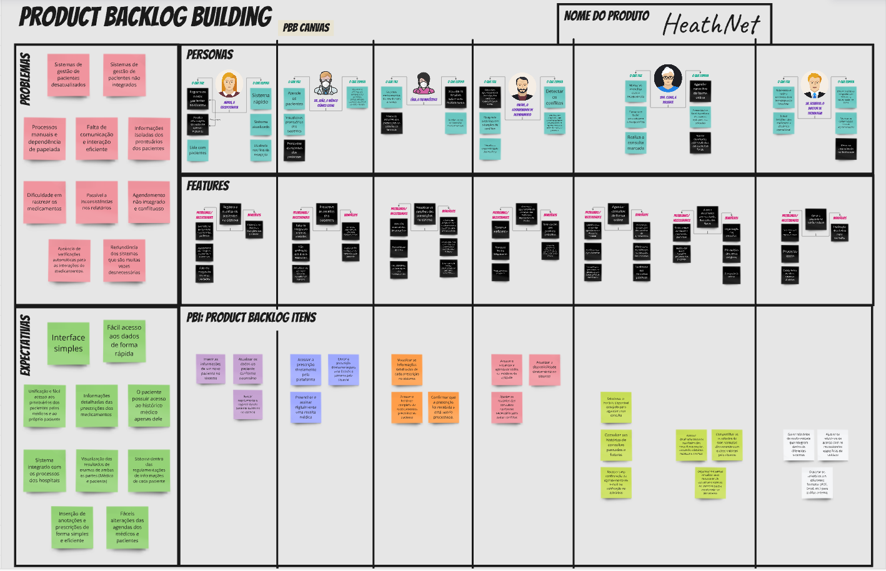

## HeathNet

A HealthNet, que opera no setor de saúde, está enfrentando desafios significativos, especialmente na eficiência dos seus processos internos, na comunicação entre diferentes departamentos e na satisfação dos pacientes. Esses problemas mostram que é necessário revisar e otimizar suas práticas, além de adotar soluções tecnológicas que possam integrar e melhorar a gestão das atividades.

Entre as principais necessidades da HealthNet estão: aprimorar a comunicação interna, padronizar os processos operacionais e criar um sistema centralizado para acesso rápido e eficiente às informações dos pacientes. Além disso, há uma demanda por ferramentas que ajudem na análise de dados, com o objetivo de melhorar a tomada de decisões e personalizar o atendimento aos pacientes.

### Problemas apontados

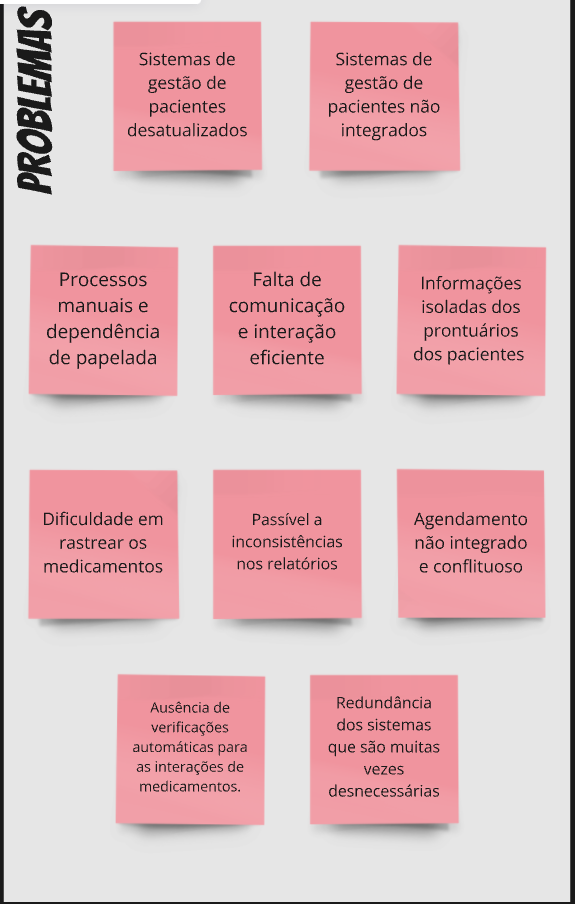

- Sistemas de gestão de pacientes desatualizados;
- Sistemas de gestão de pacientes não integrados;
- Processos manuais e dependência de papelada;
- Falta de comunicação e interação eficiente;
- Informações isoladas dos prontuários dos pacientes;
- Dificuldade em rastrear os medicamentos;
- Passível a inconsistências nos relatórios;
- Agendamento não integrado e conflituoso;
- Ausência de verificações automáticas para as interações de medicamentos;
- Redundância dos sistemas que são muitas vezes desnecessárias.

### Expectativas

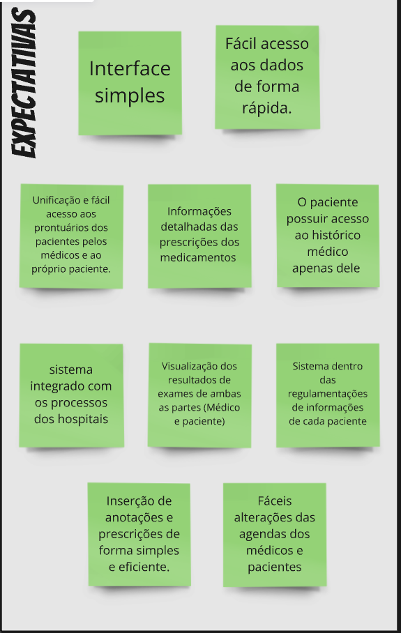

- Interface simples;
- Fácil acesso aos dados de forma rápida;
- Unificação e fácil acesso aos prontuários dos pacientes pelos médicos e ao próprio paciente;
- Informações detalhadas das prescrições dos medicamentos;
- O paciente possuir acesso ao histórico médico apenas dele;
- Sistema integrado com os processos dos hospitais;
- Visualização dos resultados de exames de ambas as partes (Médico e paciente);
- Sistema dentro das regulamentações de informações de cada paciente;
- Inserção de anotações e prescrições de forma simples e eficiente;
- Fáceis alterações das agendas dos médicos e pacientes.

### Personas

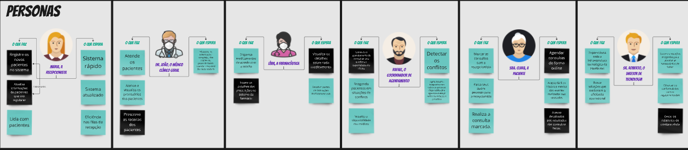

##### Maria, a Recepcionista

###### O que faz:

- Registra os novos pacientes no sistema;
- Atualiza informações de pacientes que são regulares;
- Lida com pacientes;

###### Necessidades

- Sistema rápido;
- Sistema atualizado.
- Eficiência nas filas da recepção.

##### Dr.João, o Médico Clínico Geral

###### O que faz:

- Atende os pacientes;
- Visualiza os prontuários dos pacientes;
- Prescreve as receitas dos pacientes.

###### Necessidades

- Visualizar as informações completas dos pacientes, potencializando quando o mesmo é de outra unidade.

##### Lívia, a Farmacêutica

###### O que faz:

- Dispensa medicamentos de acordo com a receita;
- Insere os detalhes das prescrições no sistema da farmácia.

###### Necessidades

- Visualiza os detalhes sobre cada medicamento;
- Receber alertas de interações medicamentosas.

##### Rafael, o Coordenador de Agendamento

###### O que faz:

- Gerencia o agendamento de consultas dos médicos e especialistas da clínica;
- Reagenda pacientes em situações de conflitos;
- Visualiza a disponibilidade dos médicos.

###### Necessidades

- Detectar os conflitos;
- Agendamento integrados com todos os dados de disponibilidade e agendamentos já feitos de médicos e pacientes.

##### Sra. Clara, a Paciente

###### O que faz:

- Marcar as consultas com a recepcionista;
- Passa seus dados pessoais para a recepcionista;
- Realiza a consulta marcada.

###### Necessidades

- Agendar consultas de forma online;
- Acesso fácil ao histórico médico dos exames realizados nas unidades;
- Acesso detalhados aos resultados das consultas feitas.

##### Sr. Roberto, o Diretor de tecnologia

###### O que faz:

- Supervisiona toda a infraestrutura tecnológica da HealthNet;
- Busca soluções que melhorem a eficiência operacional.

###### Necessidades

- Encontra soluções integradas para atender as necessidades de todos;
- Observar as conformidades com as regulamentações;
- Gerar os relatórios de conformidade.

### Features

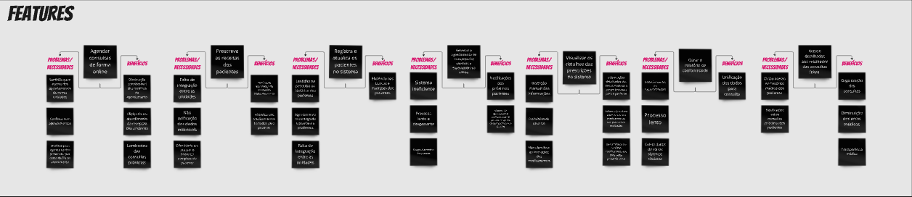

#### Features derivadas da Recepcionista

##### Registra e atualiza os pacientes no sistema

###### Problemas/Necessiadades:

- Lentidão na pesquisa do histórico dos pacientes;
- Agendamento não integrado e passíveis a problemas;
- Falta de integração entre as unidades.

###### Benefícios:

- Eficiência nas buscas e inserções dos pacientes.

#### Features derivadas do Médico

##### Prescreve as receitas dos pacientes

###### Problemas/Necessiadades:

- Falta de integração entre as unidades;
- Não unificação dos dados essenciais;
- Dificuldade em acessar o histórico completo do paciente.

###### Benefícios

- Verificação automática de interações medicamentosas;
- Histórico dos medicamentos tomados pelo paciente.

#### Features derivadas da Farmacêutica

##### Visualizar os detalhes das prescrições no sistema

###### Problemas/Necessiadades:

- Inserção manual das informações;
- Probabilidade de erros;
- Não identificar as interações dos medicamentos.

###### Benefícios

- Informações detalhadas dos medicamentos a serem tomadas para o paciente;
- Informações clara sobre o uso dos medicamentos nas prescrições realizadas;
Emitir alertas de conflitos medicamentosos para evitar possíveis erros.

##### Acesso detalhados aos resultados das consultas feitas

###### Problemas/Necessiadades:

- O não acesso ao histórico médico dos pacientes;
- Notificações sobre consultas próximas dos pacientes;

###### Benefícios

- Organização das consultas;
- Diminuição dos erros médicos;
- Transparência médica.

#### Features derivadas do Coordenador de Agendamento

##### Gerenciar o agendamento de consultas dos médicos e especialistas da clínica

###### Problemas/Necessiadades:

- Sistema ineficiente;
- Processo lento e desgastante;
- Reagendamentos frequentes.

###### Benefícios

- Notificações  dos próximos pacientes;
- Sistema de agendamento unificado que vá permitir os ajustes de forma eficiente e simples.

#### Features derivadas da Paciente

##### Agendar consultas de forma online

###### Problemas/Necessiadades:

- Lentidão para acesso dos agendamentos de outras unidades;
- Conflitos com agendamentos;
- Lentidão para agendamentos presencias por conta da fila de atendimento.

###### Benefícios

- Diminuição considerável dos conflitos de agendamento;
- Eficiência no atendimento da recepção das unidades;
- Lembretes das consultas próximas.

#### Features derivadas do Diretor de Tecnologia

##### Gerar o relatório de conformidade

###### Problemas/Necessiadades:

- Suscetível a erros de regulamentações;
- Processo lento;
- Coleta dados de vários sistemas distintos.

###### Benefícios

- Unificação dos dados para consulta.

### Product Backlog Itens

#### Feature: Agendar consultas de forma online

- Selecionar o  horário disponível desejado para agendar uma consulta;
- Consultar um histórico de consultas passadas e futuras;
- Receber uma confirmação do agendamento via e-mail ou notificação no aplicativo.

#### Feature: Prescreve as receitas dos pacientes

- Preencher e assinar digitalmente uma receita médica;
- Acessar a prescrição diretamente pela plataforma;
- Enviar a prescrição diretamente para uma farmácia parceira pelo sistema.

#### Feature: Registra e atualiza os  pacientes no sistema

- Inserir as informações de um novo paciente no sistema;
- Atualizar os dados do paciente em tempo real conforme necessário;
- Buscar rapidamente o registro de um paciente existente no sistema.

#### Feature: Gerenciar o agendamento de consultas dos médicos e especialistas da clínica

- Ajustar os horários das consultas conforme necessário para evitar conflitos;
- Acessar e visualizar a agenda de todos os médicos da unidade;
- Atualizar a disponibilidade diretamente no sistema.

#### Feature: Visualizar os detalhes das prescrições no sistema

- Visualizar as informações detalhadas de cada prescrição no sistema;
- Acessar o histórico completo de medicamentos prescritos ao paciente;
Confirmar que a prescrição foi recebida e está sendo processada.

#### Feature: Gerar o relatório de conformidade

- Gerar relatórios de conformidade que integrem dados de diferentes sistemas;
- Exportar os relatórios em diferentes formatos (PDF, Excel, etc.) para análise externa;
Ajustar os relatórios de acordo com as necessidades específicas da unidade.

#### Feature: Acesso detalhados aos resultados das consultas feitas

- Acessar detalhadamente os resultados das consultas passadas, incluindo relatórios médicos e exames;
- Compartilhar os resultados de suas consultas diretamente com outros médicos pelo sistema;
Organizar em pastas visualizar seus resultados de consultas e exames de maneira clara e estruturada na plataforma.

## PBI Priorizado utilizando COORG

Para realizar a priorização dos itens levantados do backlog, utilizamos o método COORG. O cálcuki dessa prioridade está descrito na tabela a seguir:

| Classificação | | | | | |
| :--------: | :----: | :----: | :----: | :----: | :----: |
| **Frequência de Uso** | H:5 | D:4 | S:3 | M:2 | T:1 |
| **Valor de negócio** | - | - | A:3 | M:2 | B:1 |

Formula de prioridade (+) frequência (+) valor

<iframe width="768" height="432" src="https://miro.com/app/live-embed/uXjVKoWyUpM=/?moveToViewport=-18759,18506,8371,6251&embedId=594820339107" frameborder="0" scrolling="no" allow="fullscreen; clipboard-read; clipboard-write" allowfullscreen></iframe>

## US's e Critérios de Aceitação

<iframe width="768" height="432" src="https://miro.com/app/live-embed/uXjVKoWyUpM=/?moveToViewport=-10251,13195,8771,10613&embedId=76677784546" frameborder="0" scrolling="no" allow="fullscreen; clipboard-read; clipboard-write" allowfullscreen></iframe>

### Épico: Gestão de Pacientes pela Recepção

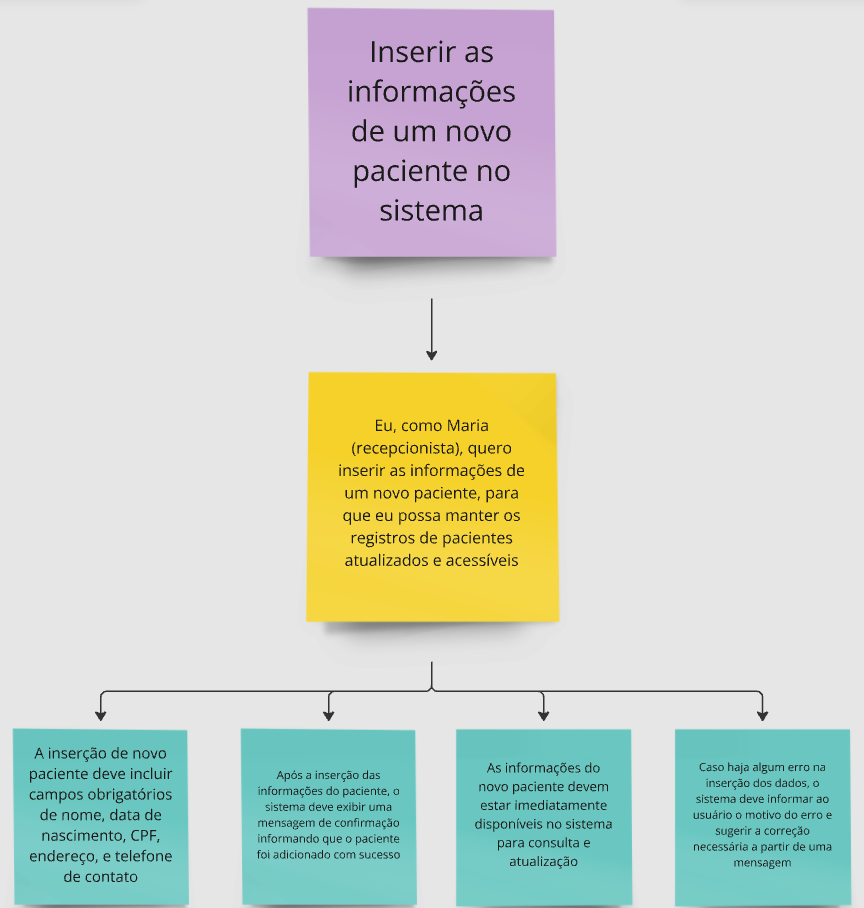
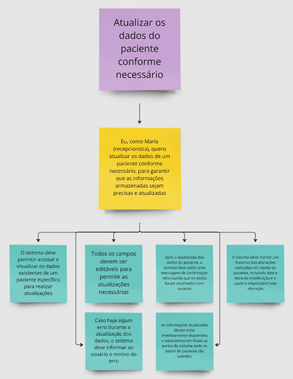
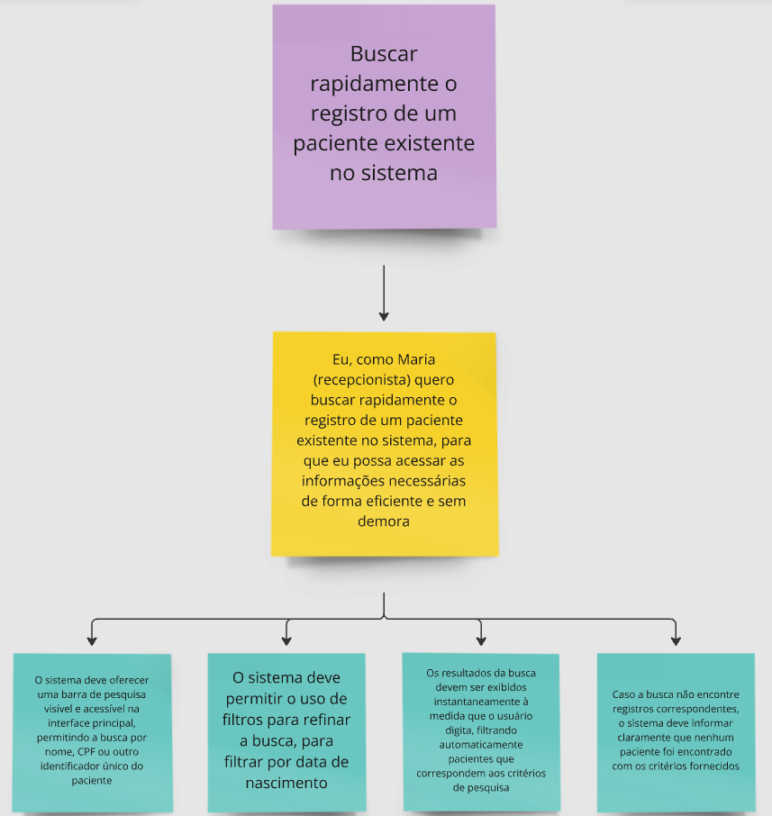

#### Critérios de aceitação do épico

##### US1: Eu, como Maria (recepcionista), quero inserir as informações de um novo paciente, para que eu possa manter os registros de pacientes atualizados e acessíveis
- A inserção de novo paciente deve incluir campos obrigatórios de nome, data de nascimento, CPF, endereço, e telefone de contato;
- Após a inserção das informações do paciente, o sistema deve exibir uma mensagem de confirmação informando que o paciente foi adicionado com sucesso;
- As informações do novo paciente devem estar imediatamente disponíveis no sistema para consulta e atualização;
- Caso haja algum erro na inserção dos dados, o sistema deve informar ao usuário o motivo do erro e sugerir a correção necessária a partir de uma mensagem.

##### US2: Eu, como Maria (recepcionista), quero atualizar os dados de um paciente conforme necessário, para garantir que as informações armazenadas sejam precisas e atualizadas
- O sistema deve permitir acessar e visualizar os dados existentes de um paciente específico para realizar atualizações;
- Todos os campos devem ser editáveis para permitir as atualizações necessárias;
- Após a atualização dos dados do paciente, o sistema deve exibir uma mensagem de confirmação informando que os dados foram atualizados com sucesso;
- O sistema deve manter um histórico das alterações realizadas nos dados do paciente, incluindo data e hora da modificação e o usuário responsável pela alteração.

##### US3: Eu, como Maria (recepcionista) quero buscar rapidamente o registro de um paciente existente no sistema, para que eu possa acessar as informações necessárias de forma eficiente e sem demora
- O sistema deve oferecer uma barra de pesquisa visível e acessível na interface principal, permitindo a busca por nome, CPF ou outro identificador único do paciente;
- O sistema deve permitir o uso de filtros para refinar a busca, para filtrar por data de nascimento;
- Os resultados da busca devem ser exibidos instantaneamente à medida que o usuário digita, filtrando automaticamente pacientes que correspondem aos critérios de pesquisa;
- Caso a busca não encontre registros correspondentes, o sistema deve informar claramente que nenhum paciente foi encontrado com os critérios fornecidos.

### Épico: Prescrição e Dispensação de Medicamentos

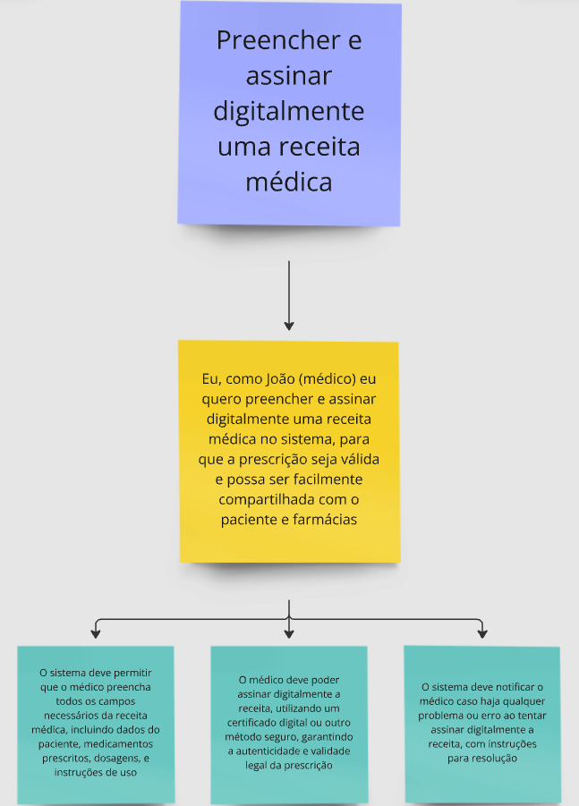
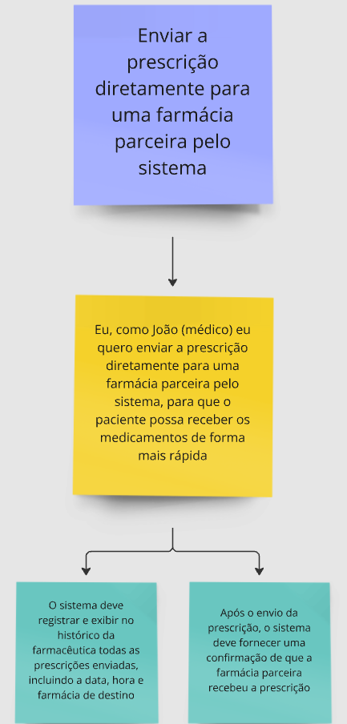
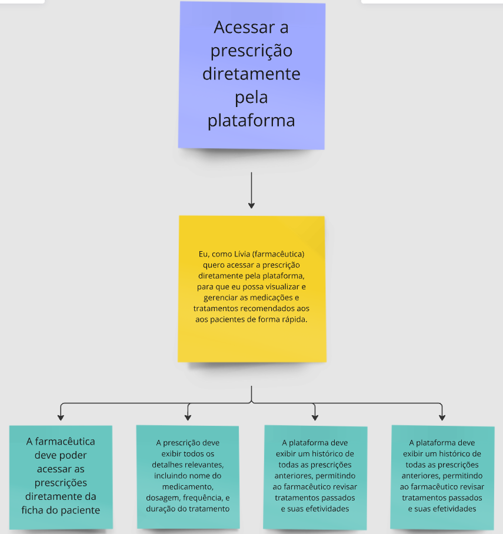

#### Critérios de aceitação do épico

##### US4: Eu, como João (médico) eu quero preencher e assinar digitalmente uma receita médica no sistema, para que a prescrição seja válida e possa ser facilmente compartilhada com o paciente e farmácias
- O sistema deve permitir que o médico preencha todos os campos necessários da receita médica, incluindo dados do paciente, medicamentos prescritos, dosagens, e instruções de uso;
- O médico deve poder assinar digitalmente a receita, utilizando um certificado digital ou outro método seguro, garantindo a autenticidade e validade legal da prescrição;
- O sistema deve notificar o médico caso haja qualquer problema ou erro ao tentar assinar digitalmente a receita, com instruções para resolução.

##### US5: Eu, como João (médico) eu quero enviar a prescrição diretamente para uma farmácia parceira pelo sistema, para que o paciente possa receber os medicamentos de forma mais rápida
- O sistema deve registrar e exibir no histórico da farmacêutica todas as prescrições enviadas, incluindo a data, hora e farmácia de destino;
- Após o envio da prescrição, o sistema deve fornecer uma confirmação de que a farmácia parceira recebeu a prescrição.

##### US6: Eu, como Lívia (farmacêutica) quero acessar a prescrição diretamente pela plataforma, para que eu possa visualizar e gerenciar as medicações e tratamentos recomendados aos aos pacientes de forma rápida.
- A farmacêutica deve poder acessar as prescrições diretamente da ficha do paciente;
- A prescrição deve exibir todos os detalhes relevantes, incluindo nome do medicamento, dosagem, frequência, e duração do tratamento;
- A plataforma deve exibir um histórico de todas as prescrições anteriores, permitindo ao farmacêutico revisar tratamentos passados e suas efetividades;
- A plataforma deve exibir um histórico de todas as prescrições anteriores, permitindo ao farmacêutico revisar tratamentos passados e suas efetividades.

### Épico: Gestão de Agendamentos para Pacientes

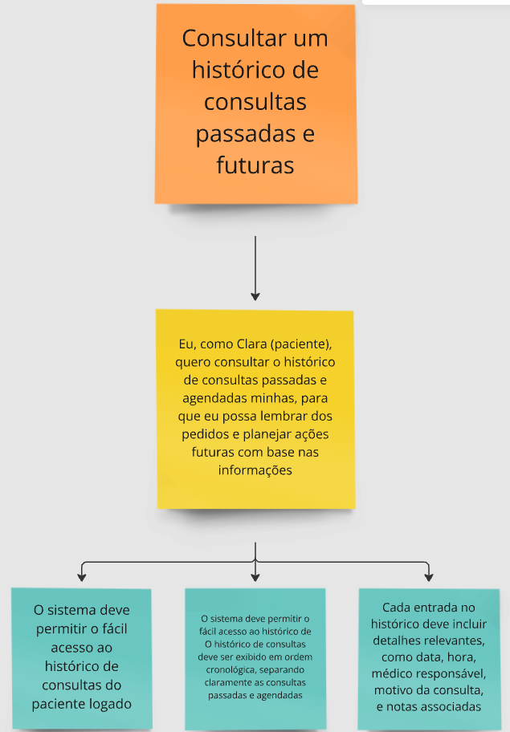
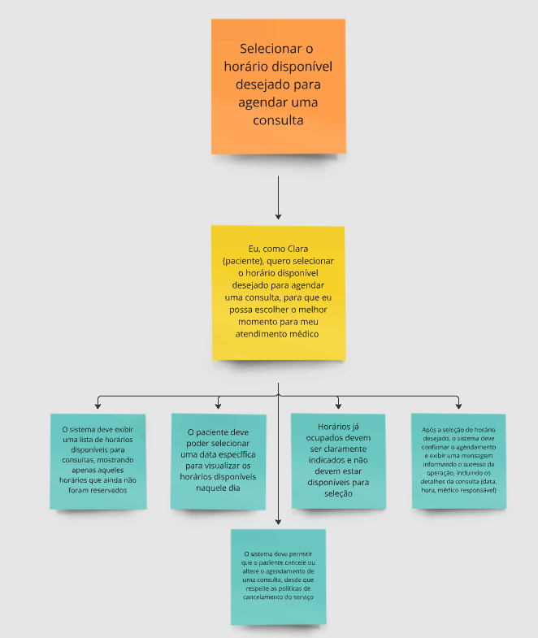
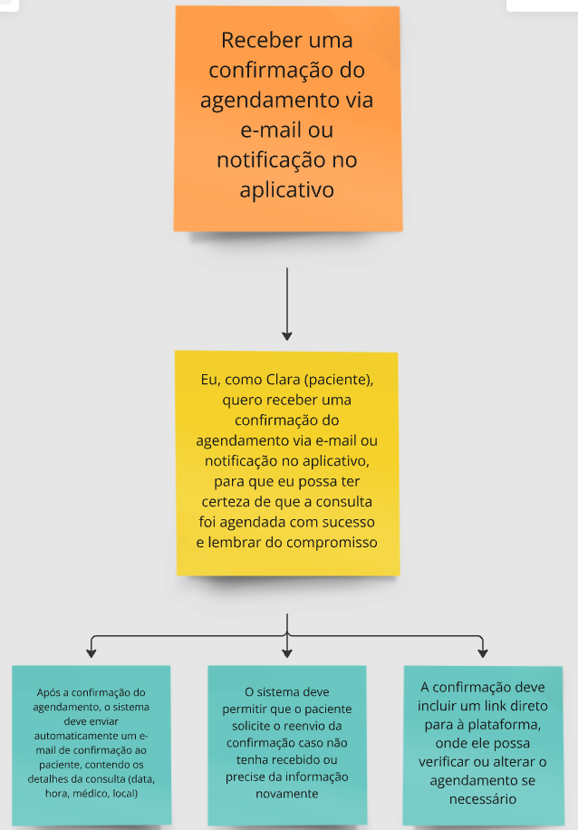

#### Critérios de aceitação do épico

##### US7: Eu, como Clara (paciente), quero consultar o histórico de consultas passadas e agendadas minhas, para que eu possa lembrar dos pedidos e planejar ações futuras com base nas informações
- O sistema deve permitir o fácil acesso ao histórico de consultas do paciente logado;
- O sistema deve permitir o fácil acesso ao histórico de O histórico de consultas deve ser exibido em ordem cronológica, separando claramente as consultas passadas e agendadas;
- Cada entrada no histórico deve incluir detalhes relevantes, como data, hora, médico responsável, motivo da consulta, e notas associadas.

##### US8: Eu, como Clara (paciente), quero selecionar o horário disponível desejado para agendar uma consulta, para que eu possa escolher o melhor momento para meu atendimento médico 
- O sistema deve exibir uma lista de horários disponíveis para consultas, mostrando apenas aqueles horários que ainda não foram reservados;
- O paciente deve poder selecionar uma data específica para visualizar os horários disponíveis naquele dia;
- Horários já ocupados devem ser claramente indicados e não devem estar disponíveis para seleção;
- Após a seleção do horário desejado, o sistema deve confirmar o agendamento e exibir uma mensagem informando o sucesso da operação, incluindo os detalhes da consulta (data, hora, médico responsável);
- O sistema deve permitir que o paciente cancele ou altere o agendamento de uma consulta, desde que respeite as políticas de cancelamento do serviço.

##### US9: Eu, como Clara (paciente), quero receber uma confirmação do agendamento via e-mail ou notificação no aplicativo, para que eu possa ter certeza de que a consulta foi agendada com sucesso e lembrar do compromisso
- Após a confirmação do agendamento, o sistema deve enviar automaticamente um e-mail de confirmação ao paciente, contendo os detalhes da consulta (data, hora, médico, local);
- O sistema deve permitir que o paciente solicite o reenvio da confirmação caso não tenha recebido ou precise da informação novamente;
- A confirmação deve incluir um link direto para à plataforma, onde ele possa verificar ou alterar o agendamento se necessário.

### Épico: Coordenação de Agendas Médicas

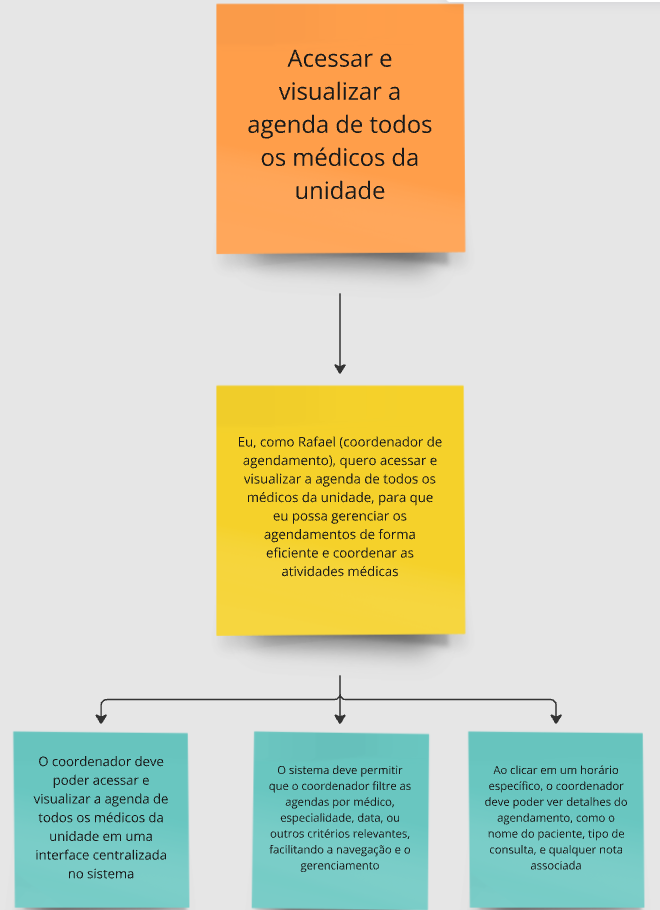
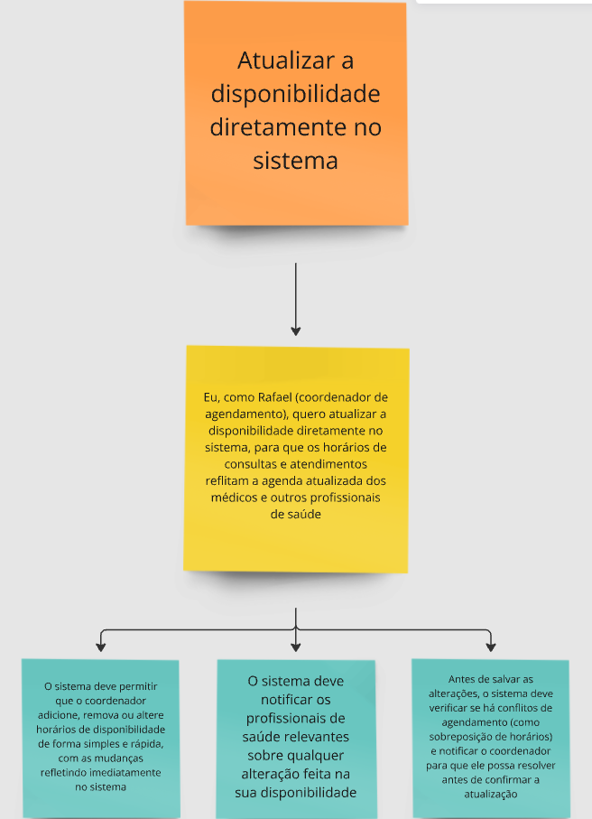
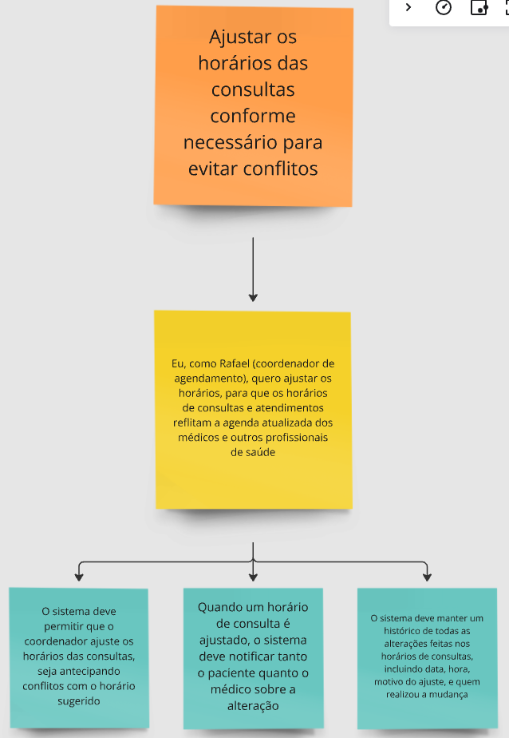

#### Critérios de aceitação do épico

##### US10: Eu, como Rafael (coordenador de agendamento), quero acessar e visualizar a agenda de todos os médicos da unidade, para que eu possa gerenciar os agendamentos de forma eficiente e coordenar as atividades médicas
- O coordenador deve poder acessar e visualizar a agenda de todos os médicos da unidade em uma interface centralizada no sistema;
- O sistema deve permitir que o coordenador filtre as agendas por médico, especialidade, data, ou outros critérios relevantes, facilitando a navegação e o gerenciamento;
- Ao clicar em um horário específico, o coordenador deve poder ver detalhes do agendamento, como o nome do paciente, tipo de consulta, e qualquer nota associada.

##### US11: Eu, como Rafael (coordenador de agendamento), quero atualizar a disponibilidade diretamente no sistema, para que os horários de consultas e atendimentos reflitam a agenda atualizada dos médicos e outros profissionais de saúde
- O sistema deve permitir que o coordenador adicione, remova ou altere horários de disponibilidade de forma simples e rápida, com as mudanças refletindo imediatamente no sistema;
- O sistema deve notificar os profissionais de saúde relevantes sobre qualquer alteração feita na sua disponibilidade;
- Antes de salvar as alterações, o sistema deve verificar se há conflitos de agendamento (como sobreposição de horários) e notificar o coordenador para que ele possa resolver antes de confirmar a atualização.

##### US12: Eu, como Rafael (coordenador de agendamento), quero ajustar os horários, para que os horários de consultas e atendimentos reflitam a agenda atualizada dos médicos e outros profissionais de saúde
- O sistema deve permitir que o coordenador ajuste os horários das consultas, seja antecipando conflitos com o horário sugerido;
- Quando um horário de consulta é ajustado, o sistema deve notificar tanto o paciente quanto o médico sobre a alteração;
- O sistema deve manter um histórico de todas as alterações feitas nos horários de consultas, incluindo data, hora, motivo do ajuste, e quem realizou a mudança.

### Épico: Gestão de Prescrições para Farmacêuticos

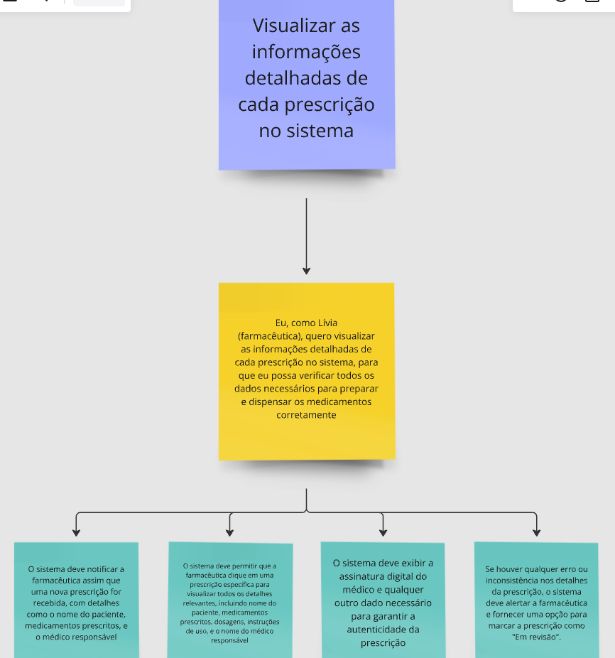
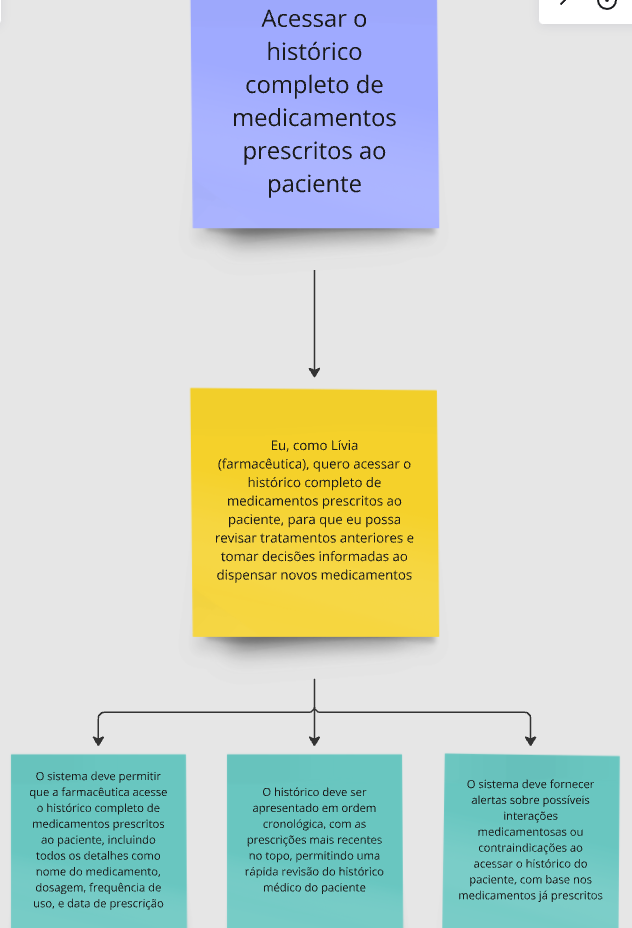
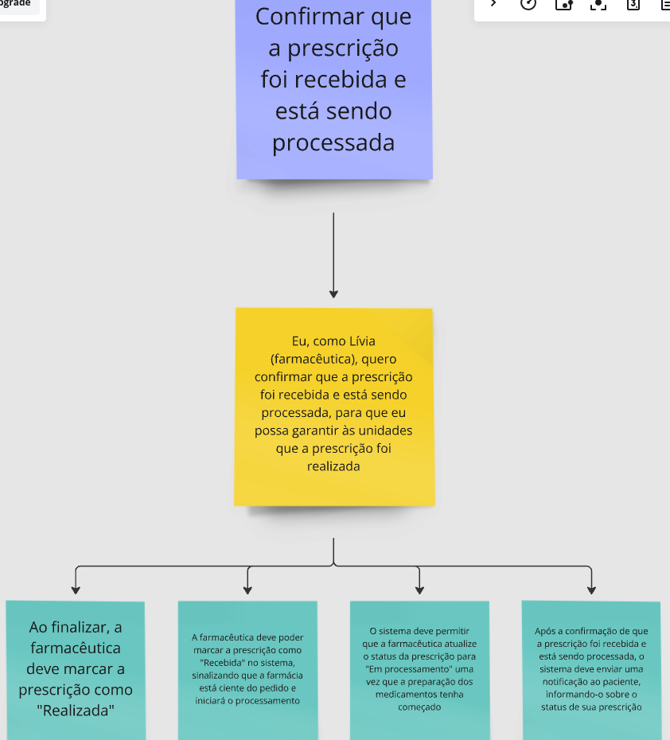

#### Critérios de aceitação do épico

##### US13: Eu, como Lívia (farmacêutica), quero visualizar as informações detalhadas de cada prescrição no sistema, para que eu possa verificar todos os dados necessários para preparar e dispensar os medicamentos corretamente
- O sistema deve notificar a farmacêutica assim que uma nova prescrição for recebida, com detalhes como o nome do paciente, medicamentos prescritos, e o médico responsável;
- O sistema deve permitir que a farmacêutica clique em uma prescrição específica para visualizar todos os detalhes relevantes, incluindo nome do paciente, medicamentos prescritos, dosagens, instruções de uso, e o nome do médico responsável;
- O sistema deve exibir a assinatura digital do médico e qualquer outro dado necessário para garantir a autenticidade da prescrição;
- Se houver qualquer erro ou inconsistência nos detalhes da prescrição, o sistema deve alertar a farmacêutica e fornecer uma opção para marcar a prescrição como "Em revisão".

##### US14: Eu, como Lívia (farmacêutica), quero acessar o histórico completo de medicamentos prescritos ao paciente, para que eu possa revisar tratamentos anteriores e tomar decisões informadas ao dispensar novos medicamentos
- O sistema deve permitir que a farmacêutica acesse o histórico completo de medicamentos prescritos ao paciente, incluindo todos os detalhes como nome do medicamento, dosagem, frequência de uso, e data de prescrição;
- O histórico deve ser apresentado em ordem cronológica, com as prescrições mais recentes no topo, permitindo uma rápida revisão do histórico médico do paciente;
- O sistema deve fornecer alertas sobre possíveis interações medicamentosas ou contraindicações ao acessar o histórico do paciente, com base nos medicamentos já prescritos.

##### US15: Eu, como Lívia (farmacêutica), quero confirmar que a prescrição foi recebida e está sendo processada, para que eu possa garantir às unidades que a prescrição foi realizada
- Ao finalizar, a farmacêutica deve marcar a prescrição como "Realizada";
- A farmacêutica deve poder marcar a prescrição como "Recebida" no sistema, sinalizando que a farmácia está ciente do pedido e iniciará o processamento;
- O sistema deve permitir que a farmacêutica atualize o status da prescrição para "Em processamento" uma vez que a preparação dos medicamentos tenha começado;
- Após a confirmação de que a prescrição foi recebida e está sendo processada, o sistema deve enviar uma notificação ao paciente, informando-o sobre o status de sua prescrição.

##### US16: Eu, como Clara (paciente), quero acessar detalhadamente os resultados das minhas consultas passadas, incluindo relatórios médicos e exames, para que eu possa acompanhar meu histórico de saúde e compartilhar informações quando necessário
- O sistema deve permitir que o paciente acesse todos os resultados de consultas passadas, incluindo relatórios médicos, exames, diagnósticos, prescrições, e notas dos médicos;
- Os resultados devem ser organizados cronologicamente, permitindo que o paciente navegue facilmente pelos diferentes registros de consultas passadas;
- O sistema deve oferecer ferramentas de pesquisa e filtros que permitam ao paciente localizar rapidamente resultados específicos, como por tipo de exame, médico, ou data da consulta.

##### US17: Eu, como Clara (paciente), quero compartilhar os resultados de minhas consultas diretamente com outros médicos pelo sistema, para que eles possam acessar meu histórico médico e fornecer um atendimento mais integrado e informado
- O paciente deve poder selecionar quais resultados de consultas (como exames, diagnósticos, receitas) deseja compartilhar com outros médicos diretamente pelo sistema;
- O sistema deve permitir que o paciente selecione os médicos com quem deseja compartilhar as informações, podendo buscar por nome, especialidade, ou localização;
- Assim que o paciente compartilhar os resultados, o médico selecionado deve ser notificado, com acesso imediato às informações compartilhadas.

### Épico: Gerenciamento de Registros de Saúde do Paciente

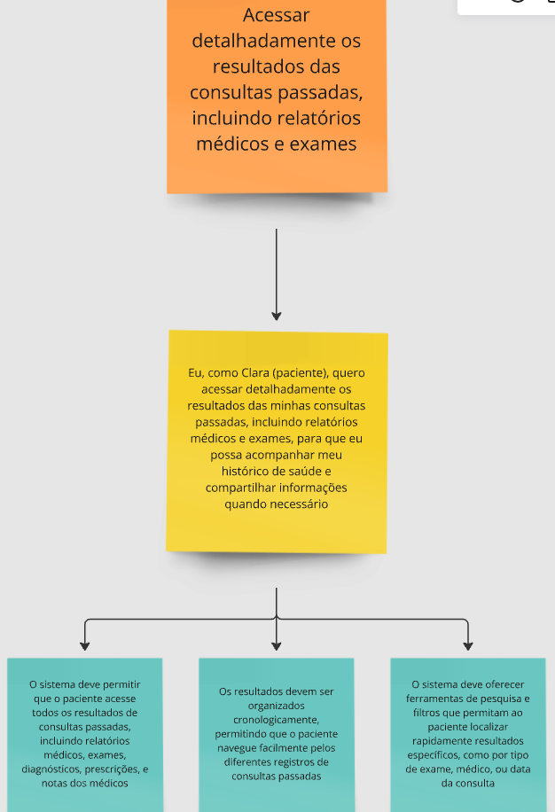
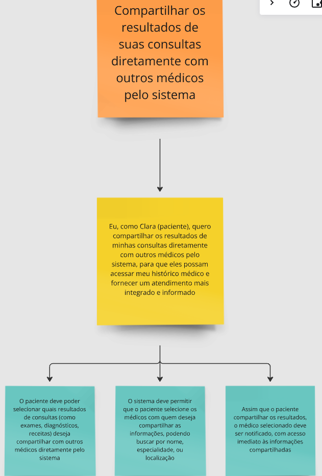
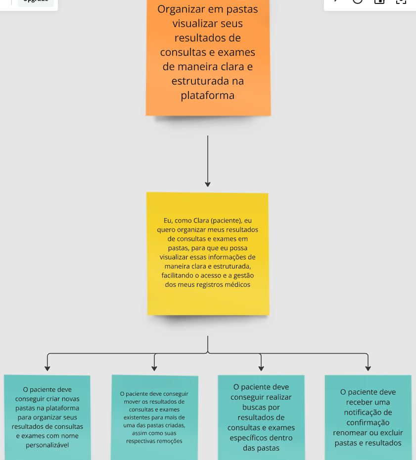

#### Critérios de aceitação do épico 

##### US16: Eu, como Clara (paciente), quero acessar detalhadamente os resultados das minhas consultas passadas, incluindo relatórios médicos e exames, para que eu possa acompanhar meu histórico de saúde e compartilhar informações quando necessário
- O sistema deve permitir que o paciente acesse todos os resultados de consultas passadas, incluindo relatórios médicos, exames, diagnósticos, prescrições, e notas dos médicos;
- Os resultados devem ser organizados cronologicamente, permitindo que o paciente navegue facilmente pelos diferentes registros de consultas passadas;
- O sistema deve oferecer ferramentas de pesquisa e filtros que permitam ao paciente localizar rapidamente resultados específicos, como por tipo de exame, médico, ou data da consulta.

##### US17: Eu, como Clara (paciente), quero compartilhar os resultados de minhas consultas diretamente com outros médicos pelo sistema, para que eles possam acessar meu histórico médico e fornecer um atendimento mais integrado e informado
- O paciente deve poder selecionar quais resultados de consultas (como exames, diagnósticos, receitas) deseja compartilhar com outros médicos diretamente pelo sistema;
- O sistema deve permitir que o paciente selecione os médicos com quem deseja compartilhar as informações, podendo buscar por nome, especialidade, ou localização;
- Assim que o paciente compartilhar os resultados, o médico selecionado deve ser notificado, com acesso imediato às informações compartilhadas.

##### US18: Eu, como Clara (paciente), eu quero organizar meus resultados de consultas e exames em pastas, para que eu possa visualizar essas informações de maneira clara e estruturada, facilitando o acesso e a gestão dos meus registros médicos
- O paciente deve conseguir criar novas pastas na plataforma para organizar seus resultados de consultas e exames com nome personalizável;
- O paciente deve conseguir mover os resultados de consultas e exames existentes para mais de uma das pastas criadas, assim como suas respectivas remoções;
- O paciente deve conseguir realizar buscas por resultados de consultas e exames específicos dentro das pastas;
- O paciente deve receber uma notificação de confirmação renomear ou excluir pastas e resultados.

### Épico: Gestão de Relatórios e Conformidade

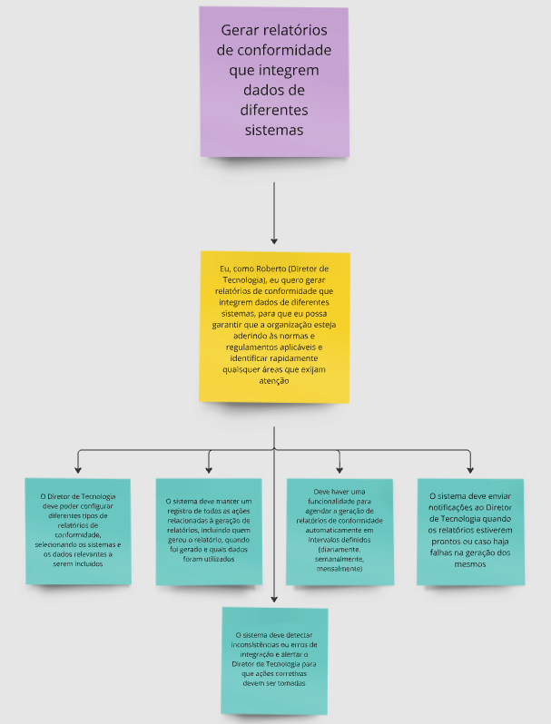
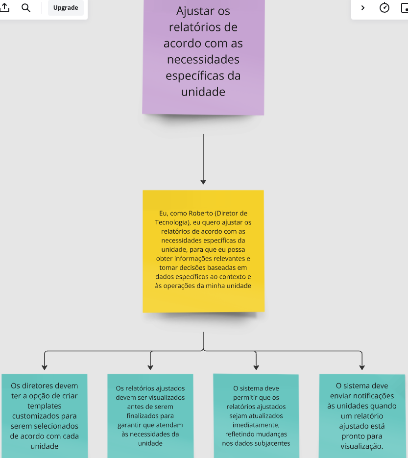
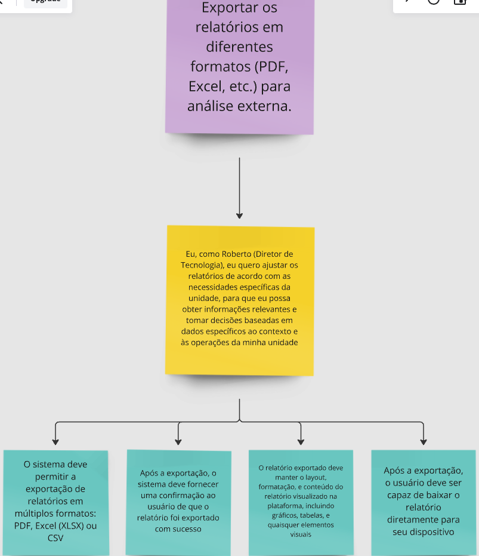

#### Critérios de aceitação do épico

##### US19: Eu, como Roberto (Diretor de Tecnologia), eu quero gerar relatórios de conformidade que integrem dados de diferentes sistemas, para que eu possa garantir que a organização esteja aderindo às normas e regulamentos aplicáveis e identificar rapidamente quaisquer áreas que exijam atenção
- O Diretor de Tecnologia deve poder configurar diferentes tipos de relatórios de conformidade, selecionando os sistemas e os dados relevantes a serem incluídos;
- O sistema deve manter um registro de todas as ações relacionadas à geração de relatórios, incluindo quem gerou o relatório, quando foi gerado e quais dados foram utilizados;
- Deve haver uma funcionalidade para agendar a geração de relatórios de conformidade automaticamente em intervalos definidos (diariamente, semanalmente, mensalmente);
- O sistema deve enviar notificações ao Diretor de Tecnologia quando os relatórios estiverem prontos ou caso haja falhas na geração dos mesmos;
- O sistema deve detectar inconsistências ou erros de integração e alertar o Diretor de Tecnologia para que ações corretivas devem ser tomadas.

##### US20: Eu, como Roberto (Diretor de Tecnologia), eu quero ajustar os relatórios de acordo com as necessidades específicas da unidade, para que eu possa obter informações relevantes e tomar decisões baseadas em dados específicos ao contexto e às operações da minha unidade
- Os diretores devem ter a opção de criar templates customizados para serem selecionados de acordo com cada unidade;
- Os relatórios ajustados devem ser visualizados antes de serem finalizados para garantir que atendam às necessidades da unidade;
- O sistema deve permitir que os relatórios ajustados sejam atualizados imediatamente, refletindo mudanças nos dados subjacentes;
- O sistema deve enviar notificações às unidades quando um relatório ajustado está pronto para visualização.

##### US21: Eu, como Roberto (Diretor de Tecnologia), eu quero ajustar os relatórios de acordo com as necessidades específicas da unidade, para que eu possa obter informações relevantes e tomar decisões baseadas em dados específicos ao contexto e às operações da minha unidade
- O sistema deve permitir a exportação de relatórios em múltiplos formatos: PDF, Excel (XLSX) ou CSV;
- Após a exportação, o sistema deve fornecer uma confirmação ao usuário de que o relatório foi exportado com sucesso;
- O relatório exportado deve manter o layout, formatação, e conteúdo do relatório visualizado na plataforma, incluindo gráficos, tabelas, e quaisquer elementos visuais;
- Após a exportação, o usuário deve ser capaz de baixar o relatório diretamente para seu dispositivo. 

## Mapa de História de Usuário (USM)

### O que é um Mapa de História de Usuário (USM)?

O **Mapa de História de Usuário (User Story Map, USM)** é uma técnica visual utilizada para organizar e priorizar as funcionalidades de um produto, com foco na experiência e necessidades do usuário. Ele ajuda as equipes a entenderem o fluxo de trabalho do usuário e como diferentes funcionalidades se conectam para formar uma experiência coesa e significativa.

O USM fornece uma visão ampla do produto, permitindo que as equipes identifiquem quais funcionalidades são essenciais para o MVP (Minimum Viable Product) e quais podem ser desenvolvidas em iterações futuras. Isso facilita o alinhamento entre a equipe de desenvolvimento, stakeholders, e o próprio usuário final.

### Como Aplicar o Mapa de História de Usuário?

1. **Identificação das Atividades Principais (Backbone)**

   - **Objetivo:** Identificar as atividades principais que o usuário realiza no sistema.
   - **Como Fazer:** Defina as metas principais que o produto deve alcançar do ponto de vista do usuário. Essas metas são as atividades que o usuário realiza e são colocadas na parte superior do mapa, em ordem sequencial.
   - **Exemplo:** Em um aplicativo de fitness, as atividades principais poderiam ser "Gerenciar Usuário", "Interagir com a Comunidade", e "Participar de Desafios".

2. **Desenvolvimento das Histórias de Usuário**

   - **Objetivo:** Especificar as histórias de usuário que detalham as tarefas necessárias para completar cada atividade principal.
   - **Como Fazer:** Para cada atividade principal, identifique as tarefas específicas que os usuários precisam realizar. Cada tarefa se transforma em uma história de usuário, que descreve uma funcionalidade específica do sistema.
   - **Exemplo:** Para a atividade "Gerenciar Usuário", as histórias de usuário poderiam incluir "Realizar Login", "Editar Perfil", e "Recuperar Senha".

3. **Organização das Histórias em Níveis (Esqueleto e Detalhes)**

   - **Objetivo:** Organizar as histórias em um mapa hierárquico, onde as mais importantes ficam no topo (esqueleto) e as menos essenciais, abaixo (detalhes e incrementos de valor).
   - **Como Fazer:** As histórias de usuário no topo representam as funcionalidades mínimas necessárias para o MVP. À medida que se desce no mapa, as histórias adicionam detalhes ou incrementos de valor, que podem ser implementados em iterações futuras.
   - **Exemplo:** No nível superior da atividade "Interagir com a Comunidade", pode-se ter "Criar Grupo" e "Acessar Estatísticas". Em níveis inferiores, podem ser adicionadas "Editar Grupo" e "Expulsar Membro".

4. **Definição do MVP (Minimum Viable Product)**

   - **Objetivo:** Delimitar quais histórias de usuário serão implementadas no MVP.
   - **Como Fazer:** Trace uma linha horizontal no mapa para separar as histórias que compõem o MVP das que serão desenvolvidas posteriormente. Tudo que está acima dessa linha faz parte do MVP, garantindo que o produto entregue o mínimo valor necessário para ser útil ao usuário.
   - **Exemplo:** No exemplo anterior, "Criar Grupo" e "Acessar Estatísticas" fariam parte do MVP, enquanto "Editar Grupo" seria um incremento de valor para futuras iterações.

5. **Colaboração e Refinamento Contínuo**
   - **Objetivo:** Usar o mapa como uma ferramenta dinâmica, revisando e atualizando-o conforme o projeto evolui.
   - **Como Fazer:** Realize revisões regulares do USM com toda a equipe e stakeholders, ajustando prioridades e adicionando ou removendo histórias conforme necessário, com base no feedback dos usuários e nas necessidades do negócio.

### Benefícios do USM

- **Visão Clara e Compartilhada:** Facilita o entendimento comum entre todos os membros da equipe sobre o que está sendo construído e por quê.
- **Priorização Eficaz:** Ajuda a priorizar funcionalidades com base no valor para o usuário, permitindo o foco no que realmente importa.
- **Planejamento de Releases:** Permite o planejamento de sprints e releases de forma estratégica, garantindo que o MVP seja alcançado rapidamente.
- **Adaptação Contínua:** Mantém o desenvolvimento flexível, permitindo ajustes com base em feedbacks contínuos.

### USM - Centelha da Revolução

## Lições Aprendidas

Após readaptar a rotina da equipe, conseguimos por todas as entregas nos trilhos de forma organizada, acabou que pecamos quanto a parte do desenvolvimento mas possuindo a ciência referente à isso, nos organizamos e iniciamos o desenvolvimento do projeto (setup de ambiente e prototipação)

## Histórico de Versão

|    Data    | Versão |          Descrição           |                  Autor(es)                   |
| :--------: | :----: | :--------------------------: | :------------------------------------------: |
| 22/08/2024 |  1.0   |       Adição da Missão       |  [Mateus Vieira](https://github.com/matix0)  |
| 22/08/2024 |  1.1   | Adição do User Story Mapping | [Dara Maria](https://github.com/daramariabs) |
| 22/08/2024 |  1.2   | Adição das lições aprendidas |  [Mateus Vieira](https://github.com/matix0)  |
| 22/08/2024 |  1.3   | Ajustes no PBB |  [Davi Rodrigues](https://github.com/DaviRogs)  |
| 03/09/2024 |  1.4   | Acresentando as US's e Critérios de aceitação |  [Davi Rodrigues](https://github.com/DaviRogs)  |